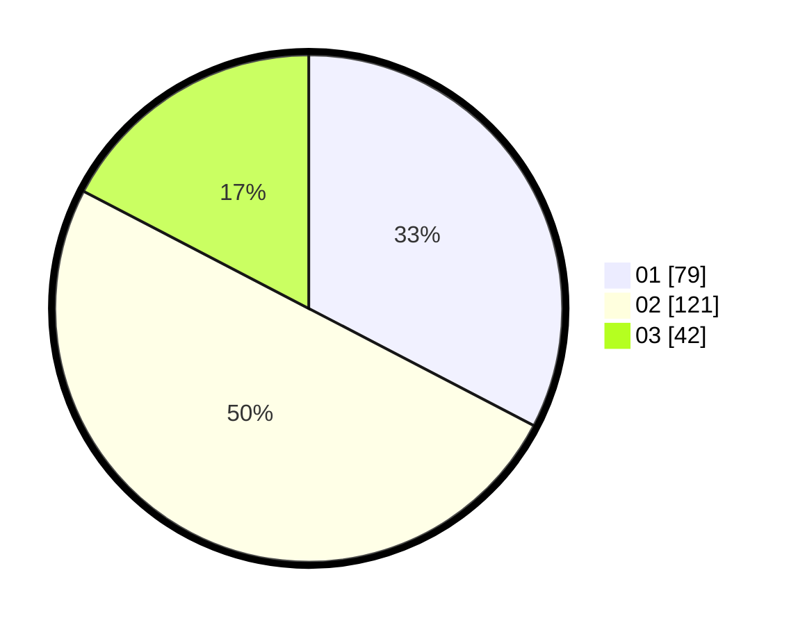

# Hasil

Hasil perolehan suara paslon dapat dilihat pada file paslon-01.txt, paslon-02.txt, dan paslon-03.txt.

Jika tidak ada, artinya data tersebut belum ada pada SIREKAP.

## Perolehan Suara

 * Paslon 01: **79**.
 * Paslon 02: **121**.
 * Paslon 03: **42**.

## Foto C Plano

https://sirekap-obj-formc.kpu.go.id/ca4f/pemilu/ppwp/31/73/06/10/01/3173061001143-20240216-201356--da7c008e-357b-4f55-945f-61257cf03a37.jpg

https://sirekap-obj-formc.kpu.go.id/ca4f/pemilu/ppwp/31/73/06/10/01/3173061001143-20240214-201352--bd110bbf-5a90-4685-87c7-9d15ca4950b3.jpg

https://sirekap-obj-formc.kpu.go.id/ca4f/pemilu/ppwp/31/73/06/10/01/3173061001143-20240214-201546--ffe7c28d-4a2a-44cc-aff9-062ebc12032e.jpg
