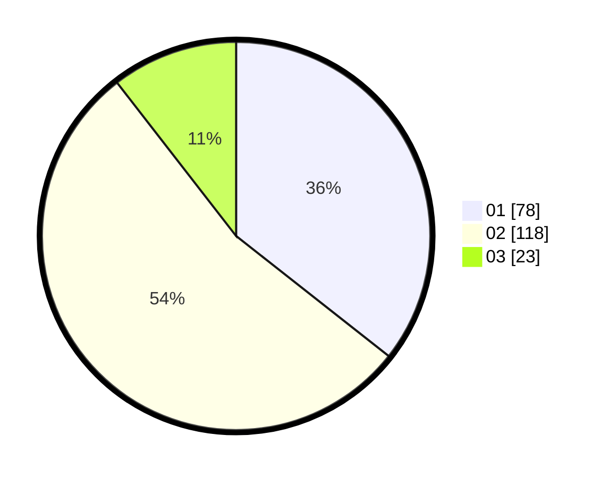

# Hasil

Hasil perolehan suara paslon dapat dilihat pada file paslon-01.txt, paslon-02.txt, dan paslon-03.txt.

Jika tidak ada, artinya data tersebut belum ada pada SIREKAP.

## Perolehan Suara

 * Paslon 01: **78**.
 * Paslon 02: **118**.
 * Paslon 03: **23**.

## Foto C Plano

https://sirekap-obj-formc.kpu.go.id/f6fa/pemilu/ppwp/31/73/06/10/01/3173061001144-20240214-213006--d49548e8-7a36-47cc-8d6b-9d70e56c51b3.jpg

https://sirekap-obj-formc.kpu.go.id/f6fa/pemilu/ppwp/31/73/06/10/01/3173061001144-20240214-213013--7fc82082-e37c-4176-a4fc-e991e94c2f98.jpg

https://sirekap-obj-formc.kpu.go.id/f6fa/pemilu/ppwp/31/73/06/10/01/3173061001144-20240214-213020--fcca5142-625f-45e3-8637-51e552548d36.jpg
