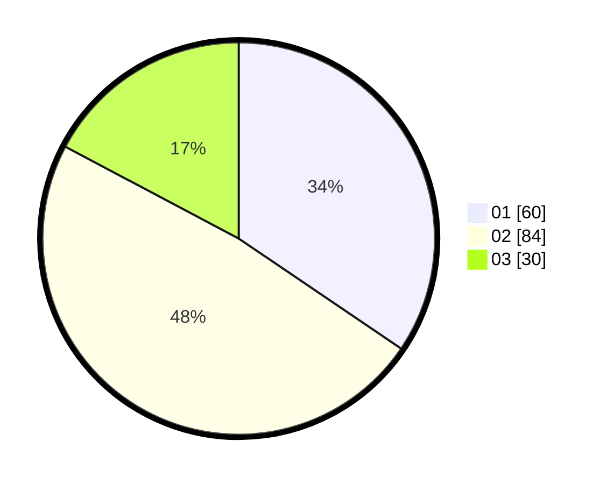

# Hasil

Hasil perolehan suara paslon dapat dilihat pada file paslon-01.txt, paslon-02.txt, dan paslon-03.txt.

Jika tidak ada, artinya data tersebut belum ada pada SIREKAP.

## Perolehan Suara

 * Paslon 01: **60**.
 * Paslon 02: **84**.
 * Paslon 03: **30**.

## Foto C Plano

https://sirekap-obj-formc.kpu.go.id/f456/pemilu/ppwp/31/73/06/10/01/3173061001147-20240214-190302--6afc0c7f-20f3-42a5-89ac-83543fcaafb1.jpg

https://sirekap-obj-formc.kpu.go.id/f456/pemilu/ppwp/31/73/06/10/01/3173061001147-20240214-200220--3ac948ab-c74a-4d17-9118-a2fe1bebdcfa.jpg

https://sirekap-obj-formc.kpu.go.id/f456/pemilu/ppwp/31/73/06/10/01/3173061001147-20240214-200325--39b90e4f-e082-454e-a02c-da7f32f63e03.jpg

## DATA PEMILIH TETAP

Jumlah pemilih dalam DPT: **224**.
 * L: **114**.
 * P: **110**.

## DATA PENGGUNA HAK PILIH

Jumlah pengguna hak pilih dalam DPT: **169**.
 * L: **81**.
 * P: **88**.

Jumlah pengguna hak pilih dalam DPTb: **0**.
 * L: **0**.
 * P: **0**.

Jumlah pengguna hak pilih dalam DPK: **9**.
 * L: **6**.
 * P: **3**.

Jumlah pengguna hak pilih: **178**.
 * L: **87**.
 * P: **91**.

## JUMLAH SUARA SAH DAN TIDAK SAH

JUMLAH SELURUH SUARA SAH: **174**.

JUMLAH SUARA TIDAK SAH: **4**.

JUMLAH SELURUH SUARA SAH DAN SUARA TIDAK SAH: **178**.
