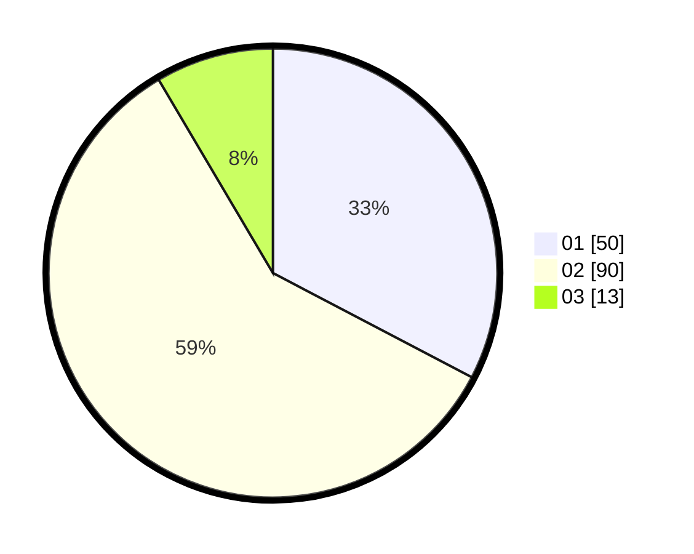

# Hasil

Hasil perolehan suara paslon dapat dilihat pada file paslon-01.txt, paslon-02.txt, dan paslon-03.txt.

Jika tidak ada, artinya data tersebut belum ada pada SIREKAP.

## Perolehan Suara

 * Paslon 01: **50**.
 * Paslon 02: **90**.
 * Paslon 03: **13**.

## Foto C Plano

https://sirekap-obj-formc.kpu.go.id/c831/pemilu/ppwp/31/73/06/10/01/3173061001148-20240215-230200--1dce8cd1-f501-4465-9756-a7bf98f57a41.jpg

https://sirekap-obj-formc.kpu.go.id/c831/pemilu/ppwp/31/73/06/10/01/3173061001148-20240215-230202--9a650689-8a3d-4a3a-9c45-19d7017dbfe0.jpg

https://sirekap-obj-formc.kpu.go.id/c831/pemilu/ppwp/31/73/06/10/01/3173061001148-20240215-230201--78b49cb1-a447-41f1-9a96-922dd771b1e7.jpg

## DATA PEMILIH TETAP

Jumlah pemilih dalam DPT: **220**.
 * L: **111**.
 * P: **109**.

## DATA PENGGUNA HAK PILIH

Jumlah pengguna hak pilih dalam DPT: **157**.
 * L: **78**.
 * P: **79**.

Jumlah pengguna hak pilih dalam DPTb: **1**.
 * L: **1**.
 * P: **0**.

Jumlah pengguna hak pilih dalam DPK: **0**.
 * L: **0**.
 * P: **0**.

Jumlah pengguna hak pilih: **158**.
 * L: **79**.
 * P: **79**.

## JUMLAH SUARA SAH DAN TIDAK SAH

JUMLAH SELURUH SUARA SAH: **153**.

JUMLAH SUARA TIDAK SAH: **5**.

JUMLAH SELURUH SUARA SAH DAN SUARA TIDAK SAH: **158**.
