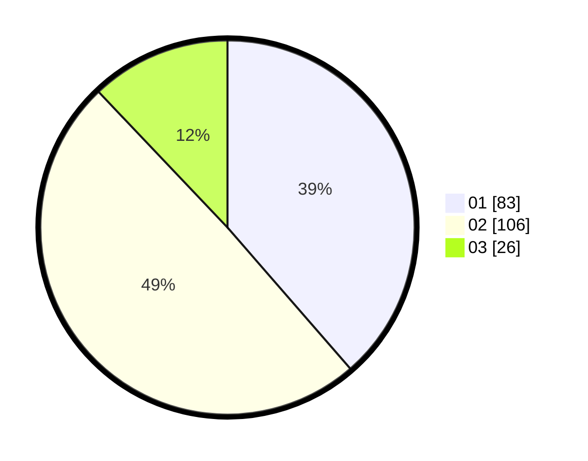

# Hasil

Hasil perolehan suara paslon dapat dilihat pada file paslon-01.txt, paslon-02.txt, dan paslon-03.txt.

Jika tidak ada, artinya data tersebut belum ada pada SIREKAP.

## Perolehan Suara

 * Paslon 01: **83**.
 * Paslon 02: **106**.
 * Paslon 03: **26**.

## Foto C Plano

https://sirekap-obj-formc.kpu.go.id/2632/pemilu/ppwp/31/73/06/10/01/3173061001150-20240214-200601--8357c75c-05a2-4d94-b53d-11e5b864c4d9.jpg

https://sirekap-obj-formc.kpu.go.id/2632/pemilu/ppwp/31/73/06/10/01/3173061001150-20240214-212654--1be81d5f-21db-4baf-8c57-444c3935e36a.jpg

https://sirekap-obj-formc.kpu.go.id/2632/pemilu/ppwp/31/73/06/10/01/3173061001150-20240214-212907--e81cf2f5-e744-41b8-a7ed-8ae15319117e.jpg
