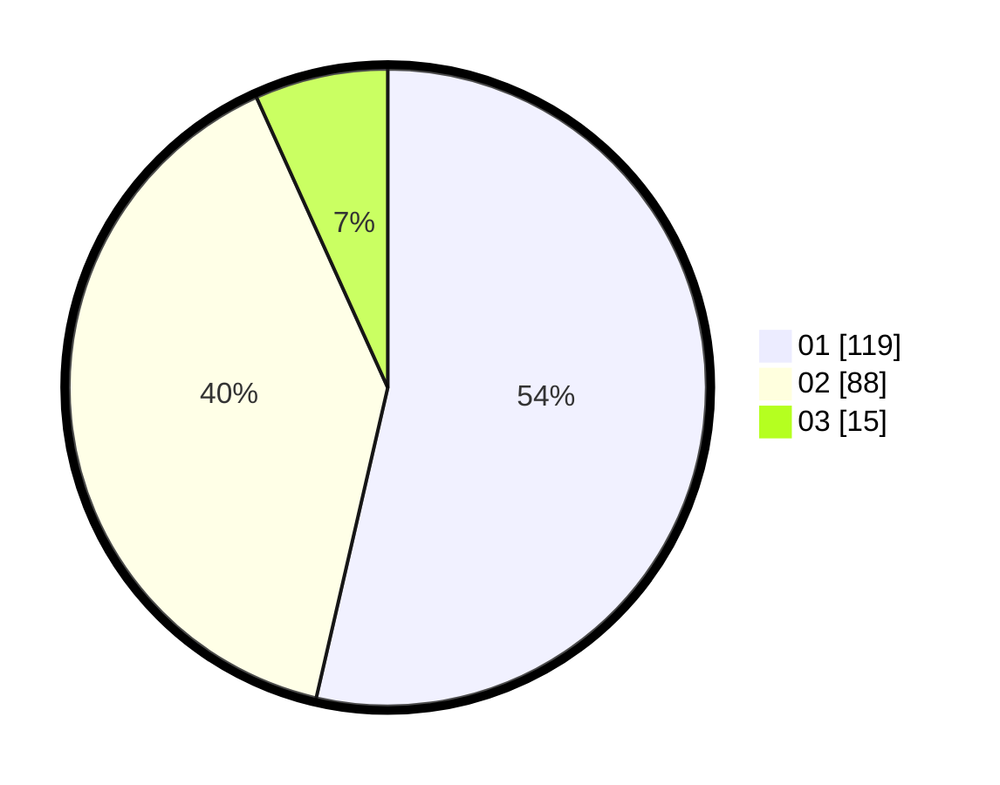

# Hasil

Hasil perolehan suara paslon dapat dilihat pada file paslon-01.txt, paslon-02.txt, dan paslon-03.txt.

Jika tidak ada, artinya data tersebut belum ada pada SIREKAP.

## Perolehan Suara

 * Paslon 01: **119**.
 * Paslon 02: **88**.
 * Paslon 03: **15**.

## Foto C Plano

https://sirekap-obj-formc.kpu.go.id/f72e/pemilu/ppwp/31/73/06/10/01/3173061001154-20240214-204550--ba69f194-63f4-4046-b555-5fb72be0769b.jpg

https://sirekap-obj-formc.kpu.go.id/f72e/pemilu/ppwp/31/73/06/10/01/3173061001154-20240215-001032--609c58e8-8ae9-440f-ad63-0a8a42fc9980.jpg

https://sirekap-obj-formc.kpu.go.id/f72e/pemilu/ppwp/31/73/06/10/01/3173061001154-20240214-204735--e442a476-5334-4e23-b15e-6f4745cdc8bd.jpg

## DATA PEMILIH TETAP

Jumlah pemilih dalam DPT: **291**.
 * L: **148**.
 * P: **143**.

## DATA PENGGUNA HAK PILIH

Jumlah pengguna hak pilih dalam DPT: **291**.
 * L: **148**.
 * P: **143**.

Jumlah pengguna hak pilih dalam DPTb: **0**.
 * L: **0**.
 * P: **0**.

Jumlah pengguna hak pilih dalam DPK: **0**.
 * L: **0**.
 * P: **0**.

Jumlah pengguna hak pilih: **291**.
 * L: **148**.
 * P: **143**.

## JUMLAH SUARA SAH DAN TIDAK SAH

JUMLAH SELURUH SUARA SAH: **222**.

JUMLAH SUARA TIDAK SAH: **4**.

JUMLAH SELURUH SUARA SAH DAN SUARA TIDAK SAH: **226**.
