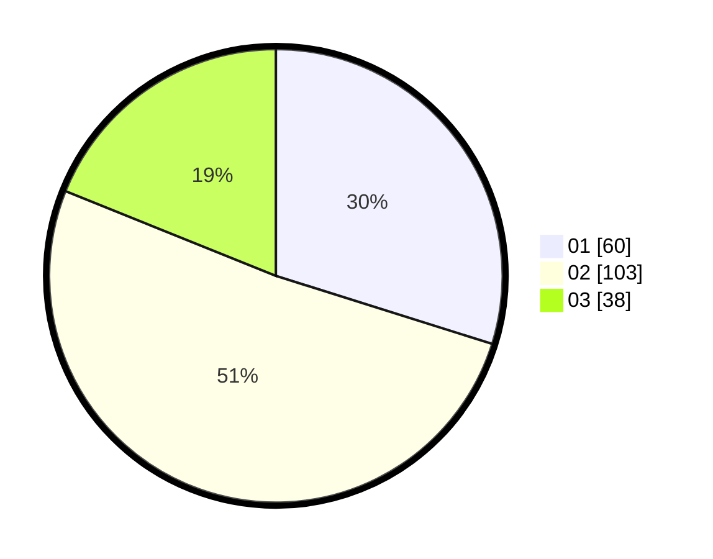

# Hasil

Hasil perolehan suara paslon dapat dilihat pada file paslon-01.txt, paslon-02.txt, dan paslon-03.txt.

Jika tidak ada, artinya data tersebut belum ada pada SIREKAP.

## Perolehan Suara

 * Paslon 01: **60**.
 * Paslon 02: **103**.
 * Paslon 03: **38**.

## Foto C Plano

https://sirekap-obj-formc.kpu.go.id/9229/pemilu/ppwp/31/73/06/10/01/3173061001160-20240214-195825--8e7b6689-d022-4aad-bf46-a9dc3e3edab7.jpg

https://sirekap-obj-formc.kpu.go.id/9229/pemilu/ppwp/31/73/06/10/01/3173061001160-20240214-195301--43e7ae4b-bbbd-481f-86a2-9516daa31557.jpg

https://sirekap-obj-formc.kpu.go.id/9229/pemilu/ppwp/31/73/06/10/01/3173061001160-20240214-191914--94d1de90-4dc9-4342-a582-677e01429173.jpg

## DATA PEMILIH TETAP

Jumlah pemilih dalam DPT: **269**.
 * L: **134**.
 * P: **135**.

## DATA PENGGUNA HAK PILIH

Jumlah pengguna hak pilih dalam DPT: **197**.
 * L: **91**.
 * P: **106**.

Jumlah pengguna hak pilih dalam DPTb: **6**.
 * L: **3**.
 * P: **3**.

Jumlah pengguna hak pilih dalam DPK: **2**.
 * L: **2**.
 * P: **0**.

Jumlah pengguna hak pilih: **205**.
 * L: **96**.
 * P: **109**.

## JUMLAH SUARA SAH DAN TIDAK SAH

JUMLAH SELURUH SUARA SAH: **201**.

JUMLAH SUARA TIDAK SAH: **4**.

JUMLAH SELURUH SUARA SAH DAN SUARA TIDAK SAH: **205**.
