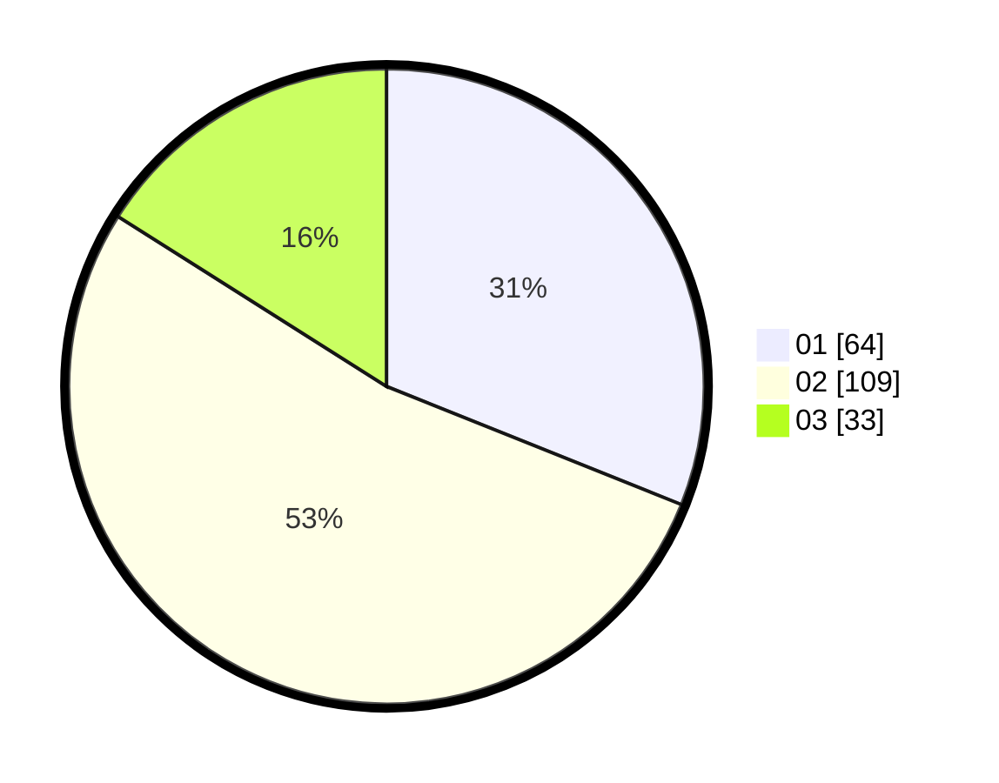

# Hasil

Hasil perolehan suara paslon dapat dilihat pada file paslon-01.txt, paslon-02.txt, dan paslon-03.txt.

Jika tidak ada, artinya data tersebut belum ada pada SIREKAP.

## Perolehan Suara

 * Paslon 01: **64**.
 * Paslon 02: **109**.
 * Paslon 03: **33**.

## Foto C Plano

https://sirekap-obj-formc.kpu.go.id/31d9/pemilu/ppwp/31/73/06/10/01/3173061001164-20240214-191020--3616ceed-a4d9-4de3-a54d-dd2b38465534.jpg

https://sirekap-obj-formc.kpu.go.id/31d9/pemilu/ppwp/31/73/06/10/01/3173061001164-20240214-192245--f6fffb60-6a80-4cd0-a901-2743693879cd.jpg

https://sirekap-obj-formc.kpu.go.id/31d9/pemilu/ppwp/31/73/06/10/01/3173061001164-20240214-193502--3b8df9d5-1da7-495c-a478-2bcccf7e3569.jpg

## DATA PEMILIH TETAP

Jumlah pemilih dalam DPT: **295**.
 * L: **144**.
 * P: **151**.

## DATA PENGGUNA HAK PILIH

Jumlah pengguna hak pilih dalam DPT: **209**.
 * L: **101**.
 * P: **108**.

Jumlah pengguna hak pilih dalam DPTb: **0**.
 * L: **0**.
 * P: **0**.

Jumlah pengguna hak pilih dalam DPK: **0**.
 * L: **0**.
 * P: **0**.

Jumlah pengguna hak pilih: **209**.
 * L: **101**.
 * P: **108**.

## JUMLAH SUARA SAH DAN TIDAK SAH

JUMLAH SELURUH SUARA SAH: **206**.

JUMLAH SUARA TIDAK SAH: **3**.

JUMLAH SELURUH SUARA SAH DAN SUARA TIDAK SAH: **209**.
