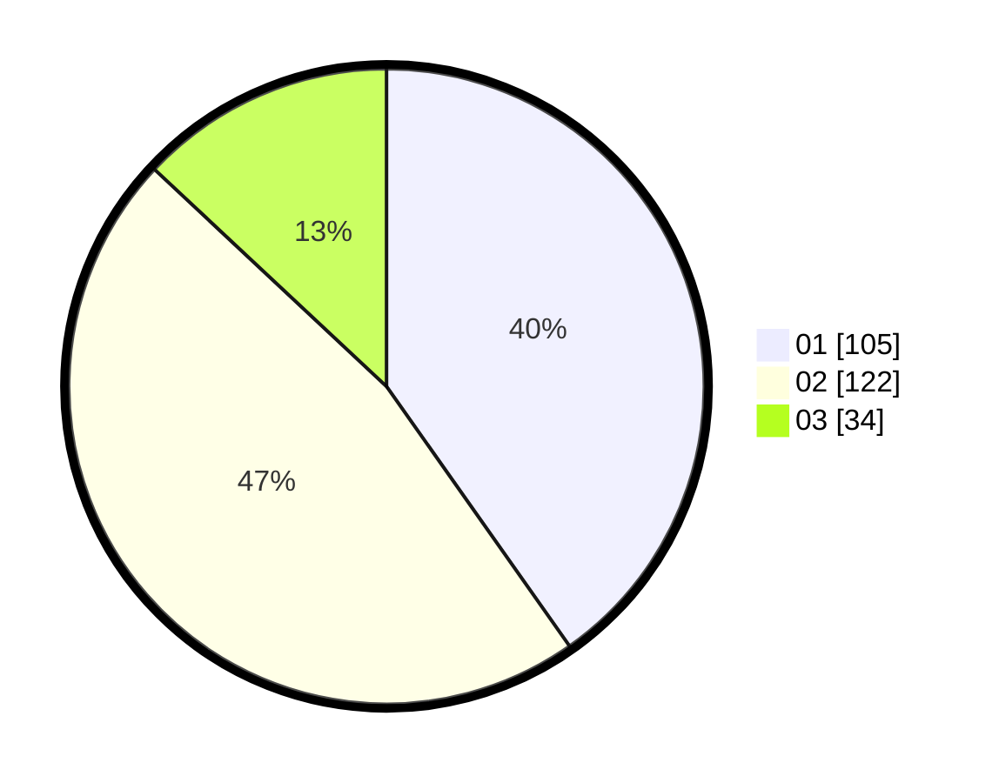

# Hasil

Hasil perolehan suara paslon dapat dilihat pada file paslon-01.txt, paslon-02.txt, dan paslon-03.txt.

Jika tidak ada, artinya data tersebut belum ada pada SIREKAP.

## Perolehan Suara

 * Paslon 01: **105**.
 * Paslon 02: **122**.
 * Paslon 03: **34**.

## Foto C Plano

https://sirekap-obj-formc.kpu.go.id/baa7/pemilu/ppwp/31/73/06/10/01/3173061001171-20240216-041054--ddc028ef-e222-4fe7-831f-f699be8fd8bb.jpg

https://sirekap-obj-formc.kpu.go.id/baa7/pemilu/ppwp/31/73/06/10/01/3173061001171-20240216-023523--0ffa2328-3cc1-41f4-82cc-9dc80f2c7156.jpg

https://sirekap-obj-formc.kpu.go.id/baa7/pemilu/ppwp/31/73/06/10/01/3173061001171-20240216-041055--fa49c2cc-19ed-42bf-b2f8-1fc3d38d48c9.jpg

## DATA PEMILIH TETAP

Jumlah pemilih dalam DPT: **299**.
 * L: **154**.
 * P: **145**.

## DATA PENGGUNA HAK PILIH

Jumlah pengguna hak pilih dalam DPT: **259**.
 * L: **123**.
 * P: **136**.

Jumlah pengguna hak pilih dalam DPTb: **3**.
 * L: **1**.
 * P: **2**.

Jumlah pengguna hak pilih dalam DPK: **1**.
 * L: **0**.
 * P: **1**.

Jumlah pengguna hak pilih: **263**.
 * L: **124**.
 * P: **139**.

## JUMLAH SUARA SAH DAN TIDAK SAH

JUMLAH SELURUH SUARA SAH: **261**.

JUMLAH SUARA TIDAK SAH: **2**.

JUMLAH SELURUH SUARA SAH DAN SUARA TIDAK SAH: **263**.
