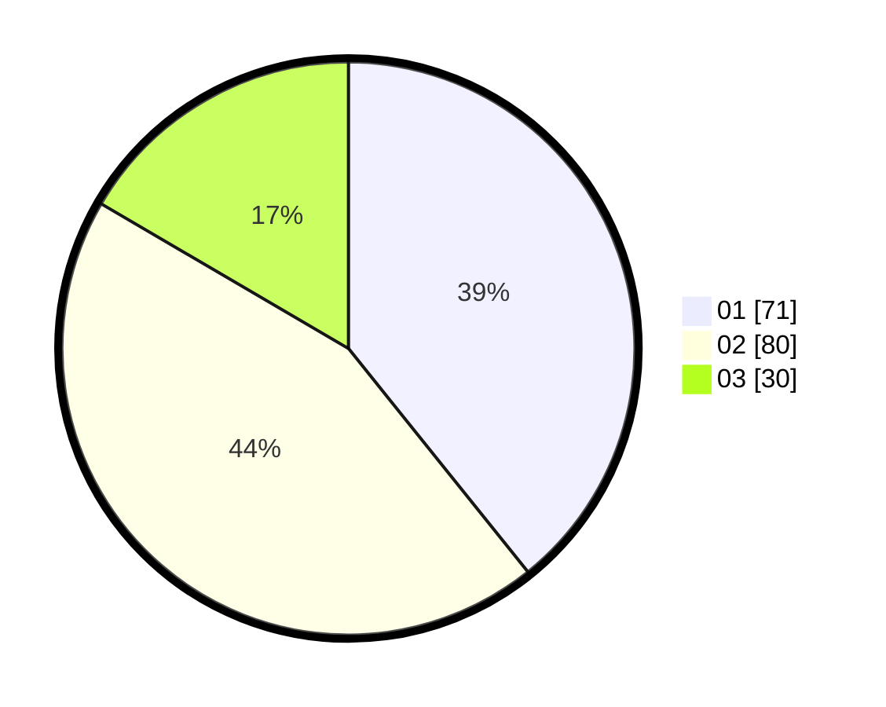

# Hasil

Hasil perolehan suara paslon dapat dilihat pada file paslon-01.txt, paslon-02.txt, dan paslon-03.txt.

Jika tidak ada, artinya data tersebut belum ada pada SIREKAP.

## Perolehan Suara

 * Paslon 01: **71**.
 * Paslon 02: **80**.
 * Paslon 03: **30**.

## Foto C Plano

https://sirekap-obj-formc.kpu.go.id/2654/pemilu/ppwp/31/73/06/10/01/3173061001177-20240214-231216--1577c6db-3d6d-4a35-9d63-3fd180b8a337.jpg

https://sirekap-obj-formc.kpu.go.id/2654/pemilu/ppwp/31/73/06/10/01/3173061001177-20240214-231305--c456d180-e3dd-47bb-8fd5-ee2e4715f829.jpg

https://sirekap-obj-formc.kpu.go.id/2654/pemilu/ppwp/31/73/06/10/01/3173061001177-20240214-231350--bb7d5080-9d5b-4105-b5b9-e07b02f7004f.jpg
