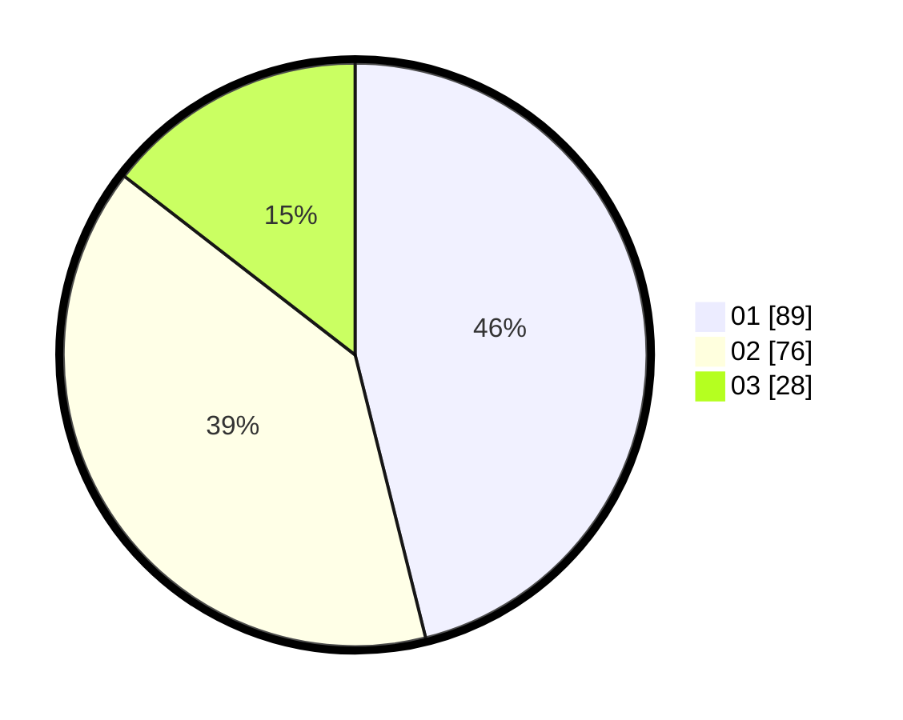

# Hasil

Hasil perolehan suara paslon dapat dilihat pada file paslon-01.txt, paslon-02.txt, dan paslon-03.txt.

Jika tidak ada, artinya data tersebut belum ada pada SIREKAP.

## Perolehan Suara

 * Paslon 01: **89**.
 * Paslon 02: **76**.
 * Paslon 03: **28**.

## Foto C Plano

https://sirekap-obj-formc.kpu.go.id/c338/pemilu/ppwp/31/73/06/10/01/3173061001180-20240214-213441--8897e35c-40ec-4403-88b2-1f2f9ed2a1f1.jpg

https://sirekap-obj-formc.kpu.go.id/c338/pemilu/ppwp/31/73/06/10/01/3173061001180-20240214-213648--055cd53f-2db1-4fa6-88d1-4c72c44a7319.jpg

https://sirekap-obj-formc.kpu.go.id/c338/pemilu/ppwp/31/73/06/10/01/3173061001180-20240214-213840--e51f446c-0186-4ffb-80a6-820a20b664c3.jpg
