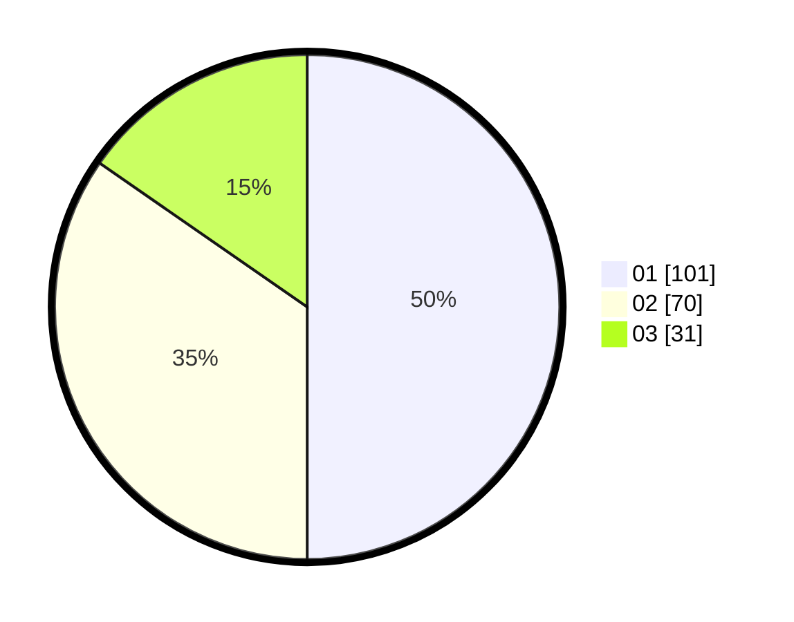

# Hasil

Hasil perolehan suara paslon dapat dilihat pada file paslon-01.txt, paslon-02.txt, dan paslon-03.txt.

Jika tidak ada, artinya data tersebut belum ada pada SIREKAP.

## Perolehan Suara

 * Paslon 01: **101**.
 * Paslon 02: **70**.
 * Paslon 03: **31**.

## Foto C Plano

https://sirekap-obj-formc.kpu.go.id/21c3/pemilu/ppwp/31/73/06/10/01/3173061001181-20240216-033743--1761583d-fc14-404f-8848-b44148086416.jpg

https://sirekap-obj-formc.kpu.go.id/21c3/pemilu/ppwp/31/73/06/10/01/3173061001181-20240216-033745--dd1a36c3-a400-4399-b841-1e59dc713d86.jpg

https://sirekap-obj-formc.kpu.go.id/21c3/pemilu/ppwp/31/73/06/10/01/3173061001181-20240216-033744--6243ab30-b2c3-4ca8-aaf2-2352e7ee5257.jpg

## DATA PEMILIH TETAP

Jumlah pemilih dalam DPT: **262**.
 * L: **134**.
 * P: **128**.

## DATA PENGGUNA HAK PILIH

Jumlah pengguna hak pilih dalam DPT: **195**.
 * L: **102**.
 * P: **93**.

Jumlah pengguna hak pilih dalam DPTb: **9**.
 * L: **4**.
 * P: **5**.

Jumlah pengguna hak pilih dalam DPK: **0**.
 * L: **0**.
 * P: **0**.

Jumlah pengguna hak pilih: **204**.
 * L: **106**.
 * P: **98**.

## JUMLAH SUARA SAH DAN TIDAK SAH

JUMLAH SELURUH SUARA SAH: **202**.

JUMLAH SUARA TIDAK SAH: **2**.

JUMLAH SELURUH SUARA SAH DAN SUARA TIDAK SAH: **204**.
