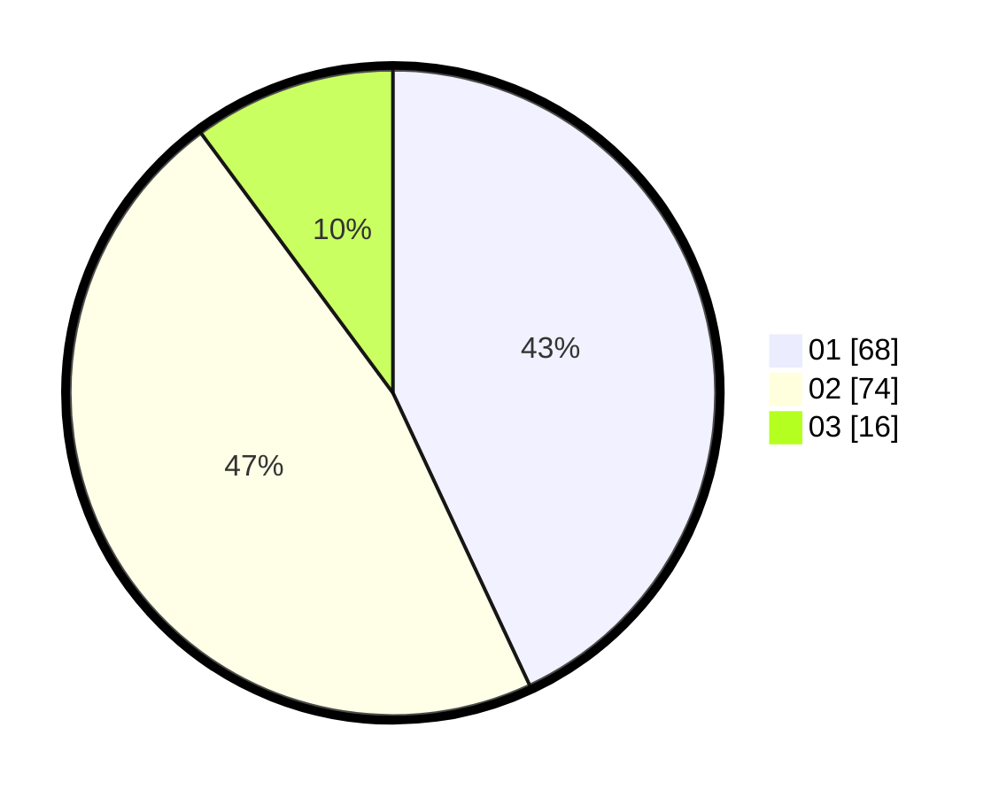

# Hasil

Hasil perolehan suara paslon dapat dilihat pada file paslon-01.txt, paslon-02.txt, dan paslon-03.txt.

Jika tidak ada, artinya data tersebut belum ada pada SIREKAP.

## Perolehan Suara

 * Paslon 01: **68**.
 * Paslon 02: **74**.
 * Paslon 03: **16**.

## Foto C Plano

https://sirekap-obj-formc.kpu.go.id/cb4c/pemilu/ppwp/31/73/06/10/01/3173061001183-20240214-200318--ac7e3513-4047-40dd-ad39-a835728f4c1b.jpg

https://sirekap-obj-formc.kpu.go.id/cb4c/pemilu/ppwp/31/73/06/10/01/3173061001183-20240216-083920--412badb8-7379-4133-b6af-076f3661fa99.jpg

https://sirekap-obj-formc.kpu.go.id/cb4c/pemilu/ppwp/31/73/06/10/01/3173061001183-20240214-200512--e9cc4339-4932-4cd5-a642-8c71388f271f.jpg

## DATA PEMILIH TETAP

Jumlah pemilih dalam DPT: **196**.
 * L: **99**.
 * P: **97**.

## DATA PENGGUNA HAK PILIH

Jumlah pengguna hak pilih dalam DPT: **155**.
 * L: **75**.
 * P: **80**.

Jumlah pengguna hak pilih dalam DPTb: **7**.
 * L: **3**.
 * P: **4**.

Jumlah pengguna hak pilih dalam DPK: **1**.
 * L: **1**.
 * P: **0**.

Jumlah pengguna hak pilih: **163**.
 * L: **79**.
 * P: **84**.

## JUMLAH SUARA SAH DAN TIDAK SAH

JUMLAH SELURUH SUARA SAH: **158**.

JUMLAH SUARA TIDAK SAH: **5**.

JUMLAH SELURUH SUARA SAH DAN SUARA TIDAK SAH: **163**.
