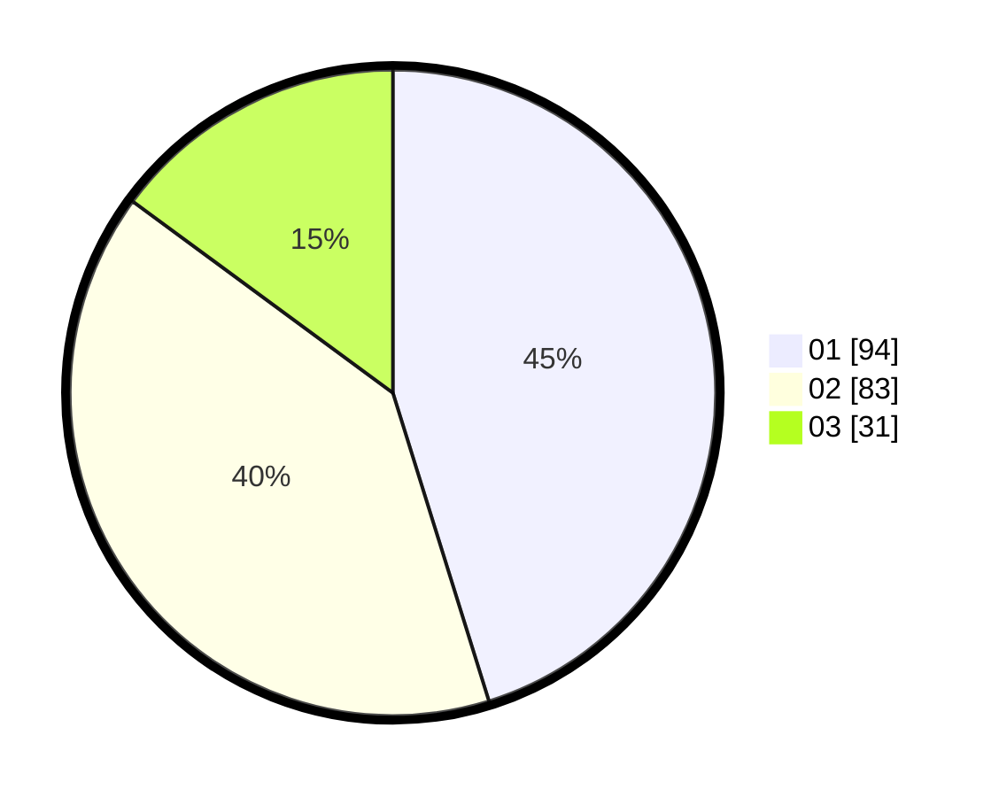

# Hasil

Hasil perolehan suara paslon dapat dilihat pada file paslon-01.txt, paslon-02.txt, dan paslon-03.txt.

Jika tidak ada, artinya data tersebut belum ada pada SIREKAP.

## Perolehan Suara

 * Paslon 01: **94**.
 * Paslon 02: **83**.
 * Paslon 03: **31**.

## Foto C Plano

https://sirekap-obj-formc.kpu.go.id/ff61/pemilu/ppwp/31/73/06/10/01/3173061001184-20240214-200553--4df35d8b-e99d-4b7c-8eb7-ab535d1136c3.jpg

https://sirekap-obj-formc.kpu.go.id/ff61/pemilu/ppwp/31/73/06/10/01/3173061001184-20240214-200720--7adae01a-105c-4d07-a302-85de87cbf0bc.jpg

https://sirekap-obj-formc.kpu.go.id/ff61/pemilu/ppwp/31/73/06/10/01/3173061001184-20240214-201041--c38481bd-bbec-4719-94e3-cd3351c6e09a.jpg

## DATA PEMILIH TETAP

Jumlah pemilih dalam DPT: **297**.
 * L: **149**.
 * P: **148**.

## DATA PENGGUNA HAK PILIH

Jumlah pengguna hak pilih dalam DPT: **213**.
 * L: **105**.
 * P: **108**.

Jumlah pengguna hak pilih dalam DPTb: **1**.
 * L: **0**.
 * P: **1**.

Jumlah pengguna hak pilih dalam DPK: **0**.
 * L: **0**.
 * P: **0**.

Jumlah pengguna hak pilih: **214**.
 * L: **105**.
 * P: **109**.

## JUMLAH SUARA SAH DAN TIDAK SAH

JUMLAH SELURUH SUARA SAH: **208**.

JUMLAH SUARA TIDAK SAH: **6**.

JUMLAH SELURUH SUARA SAH DAN SUARA TIDAK SAH: **214**.
