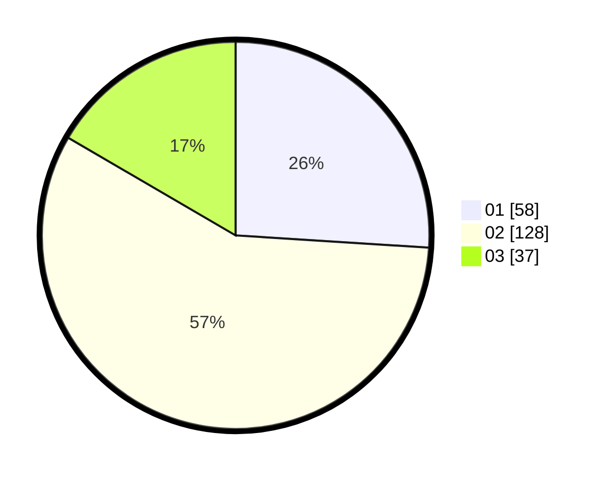

# Hasil

Hasil perolehan suara paslon dapat dilihat pada file paslon-01.txt, paslon-02.txt, dan paslon-03.txt.

Jika tidak ada, artinya data tersebut belum ada pada SIREKAP.

## Perolehan Suara

 * Paslon 01: **58**.
 * Paslon 02: **128**.
 * Paslon 03: **37**.

## Foto C Plano

https://sirekap-obj-formc.kpu.go.id/3b16/pemilu/ppwp/31/73/06/10/01/3173061001186-20240215-212518--f6f172d1-9c5b-4703-b724-f402be12acb7.jpg

https://sirekap-obj-formc.kpu.go.id/3b16/pemilu/ppwp/31/73/06/10/01/3173061001186-20240214-195813--f55c023c-8153-446e-b1f3-0067b2012abd.jpg

https://sirekap-obj-formc.kpu.go.id/3b16/pemilu/ppwp/31/73/06/10/01/3173061001186-20240214-192321--3a0e072d-f858-48b2-aacf-838e244662d1.jpg

## DATA PEMILIH TETAP

Jumlah pemilih dalam DPT: **298**.
 * L: **149**.
 * P: **149**.

## DATA PENGGUNA HAK PILIH

Jumlah pengguna hak pilih dalam DPT: **215**.
 * L: **103**.
 * P: **112**.

Jumlah pengguna hak pilih dalam DPTb: **7**.
 * L: **2**.
 * P: **5**.

Jumlah pengguna hak pilih dalam DPK: **4**.
 * L: **2**.
 * P: **2**.

Jumlah pengguna hak pilih: **226**.
 * L: **107**.
 * P: **119**.

## JUMLAH SUARA SAH DAN TIDAK SAH

JUMLAH SELURUH SUARA SAH: **223**.

JUMLAH SUARA TIDAK SAH: **3**.

JUMLAH SELURUH SUARA SAH DAN SUARA TIDAK SAH: **226**.
