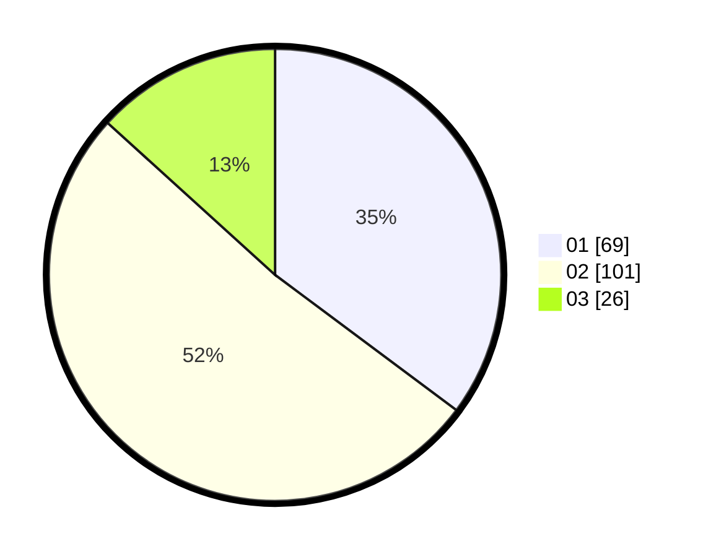

# Hasil

Hasil perolehan suara paslon dapat dilihat pada file paslon-01.txt, paslon-02.txt, dan paslon-03.txt.

Jika tidak ada, artinya data tersebut belum ada pada SIREKAP.

## Perolehan Suara

 * Paslon 01: **69**.
 * Paslon 02: **101**.
 * Paslon 03: **26**.

## Foto C Plano

https://sirekap-obj-formc.kpu.go.id/2907/pemilu/ppwp/31/73/06/10/01/3173061001187-20240214-204535--73491995-5416-40c7-9737-b0b67f0c0001.jpg

https://sirekap-obj-formc.kpu.go.id/2907/pemilu/ppwp/31/73/06/10/01/3173061001187-20240214-204742--260f0e21-061e-46c3-bf17-1dd2c93de2c5.jpg

https://sirekap-obj-formc.kpu.go.id/2907/pemilu/ppwp/31/73/06/10/01/3173061001187-20240214-204228--30715dc7-4fee-4160-976d-bb978d316302.jpg
