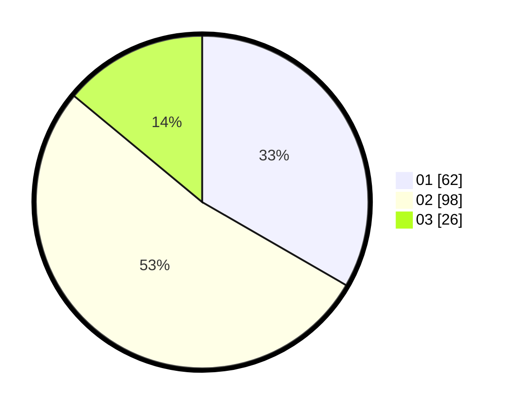

# Hasil

Hasil perolehan suara paslon dapat dilihat pada file paslon-01.txt, paslon-02.txt, dan paslon-03.txt.

Jika tidak ada, artinya data tersebut belum ada pada SIREKAP.

## Perolehan Suara

 * Paslon 01: **62**.
 * Paslon 02: **98**.
 * Paslon 03: **26**.

## Foto C Plano

https://sirekap-obj-formc.kpu.go.id/b8ca/pemilu/ppwp/31/73/06/10/01/3173061001190-20240214-162232--37d121c4-352e-428c-8eda-1a6033618918.jpg

https://sirekap-obj-formc.kpu.go.id/b8ca/pemilu/ppwp/31/73/06/10/01/3173061001190-20240216-004038--a57cfd34-cf79-4091-aeac-79adf9c7c375.jpg

https://sirekap-obj-formc.kpu.go.id/b8ca/pemilu/ppwp/31/73/06/10/01/3173061001190-20240216-004038--51a701fe-a835-4f21-83e5-6bc6f4210227.jpg

## DATA PEMILIH TETAP

Jumlah pemilih dalam DPT: **266**.
 * L: **130**.
 * P: **136**.

## DATA PENGGUNA HAK PILIH

Jumlah pengguna hak pilih dalam DPT: **171**.
 * L: **78**.
 * P: **93**.

Jumlah pengguna hak pilih dalam DPTb: **2**.
 * L: **0**.
 * P: **2**.

Jumlah pengguna hak pilih dalam DPK: **4**.
 * L: **1**.
 * P: **3**.

Jumlah pengguna hak pilih: **177**.
 * L: **79**.
 * P: **98**.

## JUMLAH SUARA SAH DAN TIDAK SAH

JUMLAH SELURUH SUARA SAH: **176**.

JUMLAH SUARA TIDAK SAH: **1**.

JUMLAH SELURUH SUARA SAH DAN SUARA TIDAK SAH: **177**.
