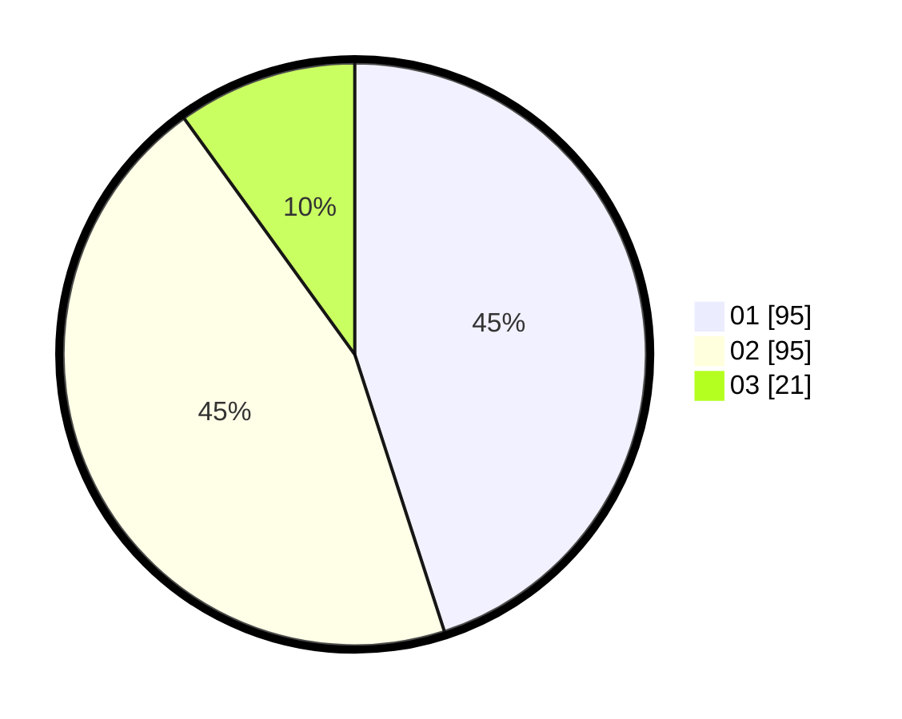

# Hasil

Hasil perolehan suara paslon dapat dilihat pada file paslon-01.txt, paslon-02.txt, dan paslon-03.txt.

Jika tidak ada, artinya data tersebut belum ada pada SIREKAP.

## Perolehan Suara

 * Paslon 01: **95**.
 * Paslon 02: **95**.
 * Paslon 03: **21**.

## Foto C Plano

https://sirekap-obj-formc.kpu.go.id/b1ea/pemilu/ppwp/31/73/06/10/01/3173061001191-20240215-204651--c61cd99d-1971-46de-bc4a-3d943a6d0401.jpg

https://sirekap-obj-formc.kpu.go.id/b1ea/pemilu/ppwp/31/73/06/10/01/3173061001191-20240215-204653--12e83054-35ab-4b74-84ce-a7698cb349ed.jpg

https://sirekap-obj-formc.kpu.go.id/b1ea/pemilu/ppwp/31/73/06/10/01/3173061001191-20240215-204652--8d7cb09f-4010-46a8-8fba-556230e8a2dc.jpg

## DATA PEMILIH TETAP

Jumlah pemilih dalam DPT: **290**.
 * L: **146**.
 * P: **144**.

## DATA PENGGUNA HAK PILIH

Jumlah pengguna hak pilih dalam DPT: **207**.
 * L: **101**.
 * P: **106**.

Jumlah pengguna hak pilih dalam DPTb: **7**.
 * L: **5**.
 * P: **2**.

Jumlah pengguna hak pilih dalam DPK: **0**.
 * L: **0**.
 * P: **0**.

Jumlah pengguna hak pilih: **214**.
 * L: **106**.
 * P: **108**.

## JUMLAH SUARA SAH DAN TIDAK SAH

JUMLAH SELURUH SUARA SAH: **211**.

JUMLAH SUARA TIDAK SAH: **3**.

JUMLAH SELURUH SUARA SAH DAN SUARA TIDAK SAH: **214**.
