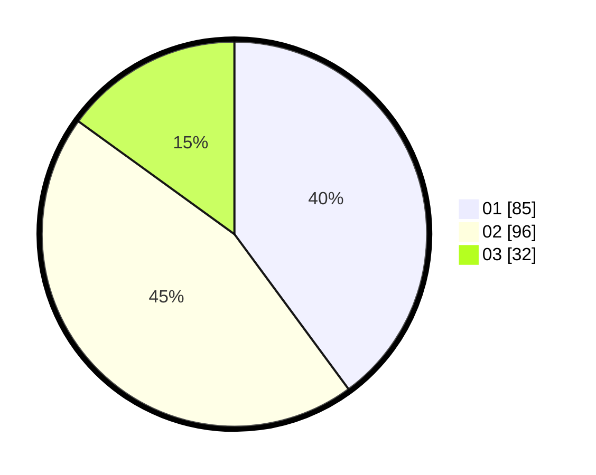

# Hasil

Hasil perolehan suara paslon dapat dilihat pada file paslon-01.txt, paslon-02.txt, dan paslon-03.txt.

Jika tidak ada, artinya data tersebut belum ada pada SIREKAP.

## Perolehan Suara

 * Paslon 01: **85**.
 * Paslon 02: **96**.
 * Paslon 03: **32**.

## Foto C Plano

https://sirekap-obj-formc.kpu.go.id/da4e/pemilu/ppwp/31/73/06/10/01/3173061001192-20240215-043328--e57b5a9b-e76f-42af-bf06-c9ee722cf8d9.jpg

https://sirekap-obj-formc.kpu.go.id/da4e/pemilu/ppwp/31/73/06/10/01/3173061001192-20240215-043709--04a61d21-dd64-4ced-b163-fa972493858f.jpg

https://sirekap-obj-formc.kpu.go.id/da4e/pemilu/ppwp/31/73/06/10/01/3173061001192-20240215-043810--9fef5c9e-cb3d-4d84-8ee4-be3e5e3e7490.jpg
