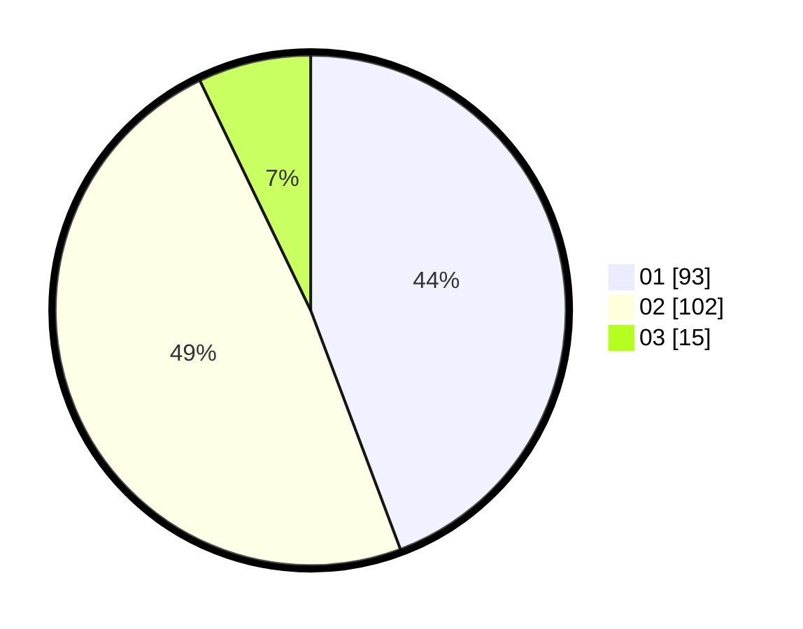

# Hasil

Hasil perolehan suara paslon dapat dilihat pada file paslon-01.txt, paslon-02.txt, dan paslon-03.txt.

Jika tidak ada, artinya data tersebut belum ada pada SIREKAP.

## Perolehan Suara

 * Paslon 01: **93**.
 * Paslon 02: **102**.
 * Paslon 03: **15**.

## Foto C Plano

https://sirekap-obj-formc.kpu.go.id/d0d4/pemilu/ppwp/31/73/06/10/01/3173061001198-20240214-214129--6f142f2f-95e4-4c7b-94e6-d0ef6d150a71.jpg

https://sirekap-obj-formc.kpu.go.id/d0d4/pemilu/ppwp/31/73/06/10/01/3173061001198-20240214-214157--5dbdd6ce-7bea-4f8d-bdec-85c8c4bb3b4b.jpg

https://sirekap-obj-formc.kpu.go.id/d0d4/pemilu/ppwp/31/73/06/10/01/3173061001198-20240214-214147--674af06c-ef63-4dda-be0a-c6da6bc7c25f.jpg

## DATA PEMILIH TETAP

Jumlah pemilih dalam DPT: **283**.
 * L: **141**.
 * P: **142**.

## DATA PENGGUNA HAK PILIH

Jumlah pengguna hak pilih dalam DPT: **211**.
 * L: **100**.
 * P: **111**.

Jumlah pengguna hak pilih dalam DPTb: **0**.
 * L: **0**.
 * P: **0**.

Jumlah pengguna hak pilih dalam DPK: **3**.
 * L: **1**.
 * P: **2**.

Jumlah pengguna hak pilih: **214**.
 * L: **101**.
 * P: **113**.

## JUMLAH SUARA SAH DAN TIDAK SAH

JUMLAH SELURUH SUARA SAH: **210**.

JUMLAH SUARA TIDAK SAH: **4**.

JUMLAH SELURUH SUARA SAH DAN SUARA TIDAK SAH: **214**.
