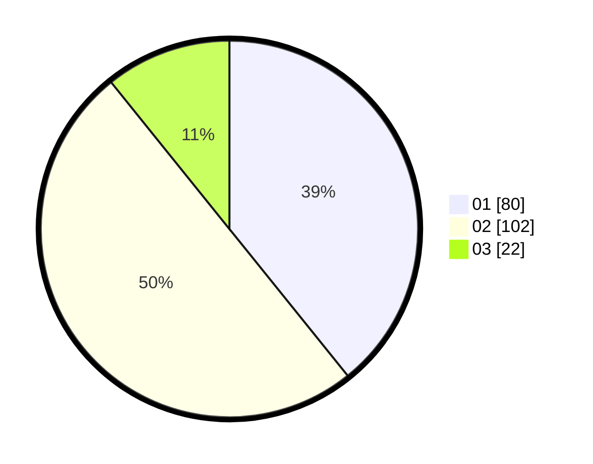

# Hasil

Hasil perolehan suara paslon dapat dilihat pada file paslon-01.txt, paslon-02.txt, dan paslon-03.txt.

Jika tidak ada, artinya data tersebut belum ada pada SIREKAP.

## Perolehan Suara

 * Paslon 01: **80**.
 * Paslon 02: **102**.
 * Paslon 03: **22**.

## Foto C Plano

https://sirekap-obj-formc.kpu.go.id/54b0/pemilu/ppwp/31/73/06/10/01/3173061001199-20240214-160130--5f0559f7-a365-4742-819f-063c932c5f6f.jpg

https://sirekap-obj-formc.kpu.go.id/54b0/pemilu/ppwp/31/73/06/10/01/3173061001199-20240214-160136--5866a0f1-d3cc-480a-88bf-2087eb462a8f.jpg

https://sirekap-obj-formc.kpu.go.id/54b0/pemilu/ppwp/31/73/06/10/01/3173061001199-20240214-160141--820c1e99-5bc8-40c8-9401-9fb68b15e3bb.jpg
