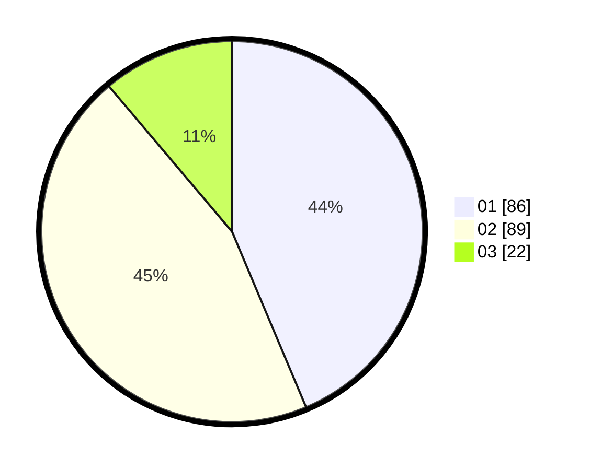

# Hasil

Hasil perolehan suara paslon dapat dilihat pada file paslon-01.txt, paslon-02.txt, dan paslon-03.txt.

Jika tidak ada, artinya data tersebut belum ada pada SIREKAP.

## Perolehan Suara

 * Paslon 01: **86**.
 * Paslon 02: **89**.
 * Paslon 03: **22**.

## Foto C Plano

https://sirekap-obj-formc.kpu.go.id/7889/pemilu/ppwp/31/73/06/10/01/3173061001201-20240214-190443--a7d79ed9-f060-43f6-b13c-c191dbe059b3.jpg

https://sirekap-obj-formc.kpu.go.id/7889/pemilu/ppwp/31/73/06/10/01/3173061001201-20240214-190544--a075bcea-eb44-436a-bed3-d72bd43bfeef.jpg

https://sirekap-obj-formc.kpu.go.id/7889/pemilu/ppwp/31/73/06/10/01/3173061001201-20240214-191830--277a045d-3b4d-4ae5-8356-e62a2ef1d9d8.jpg

## DATA PEMILIH TETAP

Jumlah pemilih dalam DPT: **282**.
 * L: **151**.
 * P: **131**.

## DATA PENGGUNA HAK PILIH

Jumlah pengguna hak pilih dalam DPT: **202**.
 * L: **102**.
 * P: **100**.

Jumlah pengguna hak pilih dalam DPTb: **0**.
 * L: **0**.
 * P: **0**.

Jumlah pengguna hak pilih dalam DPK: **0**.
 * L: **0**.
 * P: **0**.

Jumlah pengguna hak pilih: **202**.
 * L: **102**.
 * P: **100**.

## JUMLAH SUARA SAH DAN TIDAK SAH

JUMLAH SELURUH SUARA SAH: **197**.

JUMLAH SUARA TIDAK SAH: **25**.

JUMLAH SELURUH SUARA SAH DAN SUARA TIDAK SAH: **202**.
