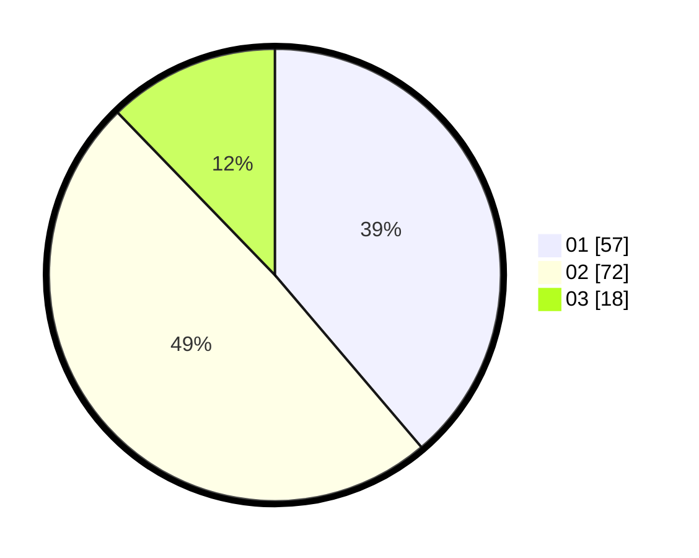

# Hasil

Hasil perolehan suara paslon dapat dilihat pada file paslon-01.txt, paslon-02.txt, dan paslon-03.txt.

Jika tidak ada, artinya data tersebut belum ada pada SIREKAP.

## Perolehan Suara

 * Paslon 01: **57**.
 * Paslon 02: **72**.
 * Paslon 03: **18**.

## Foto C Plano

https://sirekap-obj-formc.kpu.go.id/253d/pemilu/ppwp/31/73/06/10/01/3173061001204-20240216-061535--a10ddfc4-981c-4f7a-9c93-f74da93d9911.jpg

https://sirekap-obj-formc.kpu.go.id/253d/pemilu/ppwp/31/73/06/10/01/3173061001204-20240216-061537--5d95d21c-02e9-431e-ac41-4df878937789.jpg

https://sirekap-obj-formc.kpu.go.id/253d/pemilu/ppwp/31/73/06/10/01/3173061001204-20240216-061536--a27099ec-3ffc-46c3-bf17-cf8e08ec5254.jpg

## DATA PEMILIH TETAP

Jumlah pemilih dalam DPT: **211**.
 * L: **100**.
 * P: **111**.

## DATA PENGGUNA HAK PILIH

Jumlah pengguna hak pilih dalam DPT: **149**.
 * L: **67**.
 * P: **82**.

Jumlah pengguna hak pilih dalam DPTb: **1**.
 * L: **1**.
 * P: **0**.

Jumlah pengguna hak pilih dalam DPK: **1**.
 * L: **0**.
 * P: **1**.

Jumlah pengguna hak pilih: **151**.
 * L: **68**.
 * P: **83**.

## JUMLAH SUARA SAH DAN TIDAK SAH

JUMLAH SELURUH SUARA SAH: **147**.

JUMLAH SUARA TIDAK SAH: **4**.

JUMLAH SELURUH SUARA SAH DAN SUARA TIDAK SAH: **151**.
