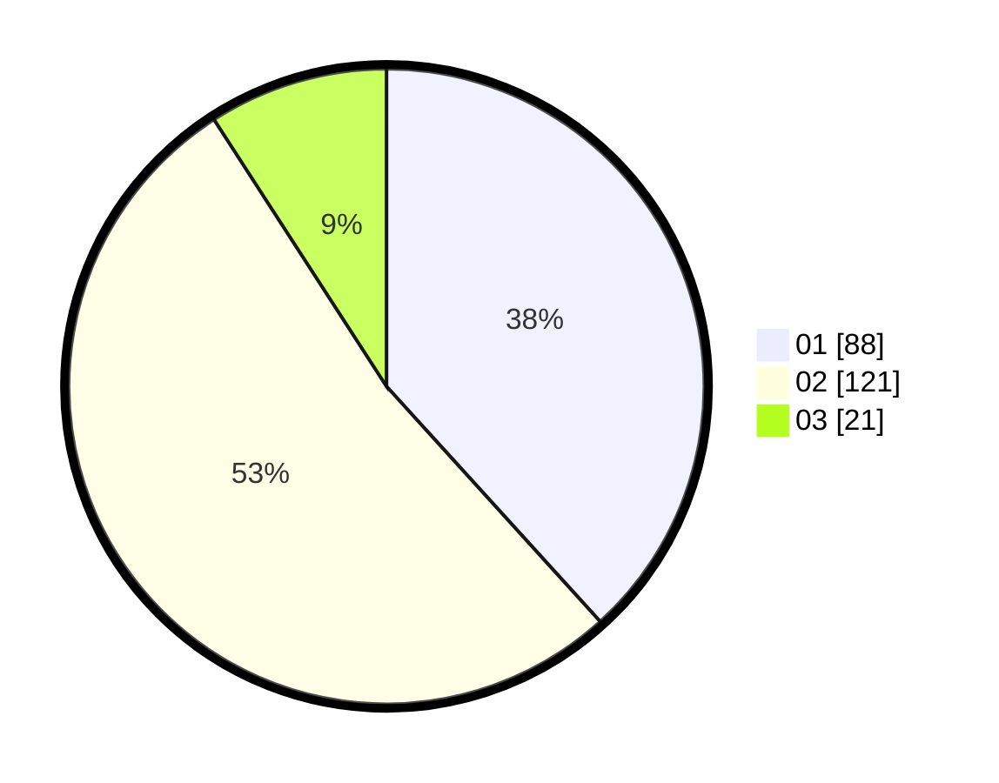

# Hasil

Hasil perolehan suara paslon dapat dilihat pada file paslon-01.txt, paslon-02.txt, dan paslon-03.txt.

Jika tidak ada, artinya data tersebut belum ada pada SIREKAP.

## Perolehan Suara

 * Paslon 01: **88**.
 * Paslon 02: **121**.
 * Paslon 03: **21**.

## Foto C Plano

https://sirekap-obj-formc.kpu.go.id/eaf9/pemilu/ppwp/31/73/06/10/01/3173061001207-20240215-174030--f0dc540d-0160-4f40-abb7-968607f18014.jpg

https://sirekap-obj-formc.kpu.go.id/eaf9/pemilu/ppwp/31/73/06/10/01/3173061001207-20240214-232014--d56d44b1-e2c6-4f5f-8e14-6ab5805b4bb4.jpg

https://sirekap-obj-formc.kpu.go.id/eaf9/pemilu/ppwp/31/73/06/10/01/3173061001207-20240214-232214--a83ce98c-db7a-4afe-a9c3-78ee112e4ad1.jpg
