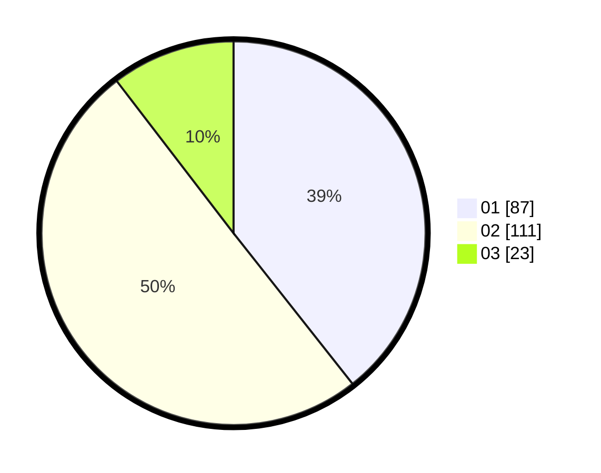

# Hasil

Hasil perolehan suara paslon dapat dilihat pada file paslon-01.txt, paslon-02.txt, dan paslon-03.txt.

Jika tidak ada, artinya data tersebut belum ada pada SIREKAP.

## Perolehan Suara

 * Paslon 01: **87**.
 * Paslon 02: **111**.
 * Paslon 03: **23**.

## Foto C Plano

https://sirekap-obj-formc.kpu.go.id/27ee/pemilu/ppwp/31/73/06/10/01/3173061001208-20240214-212206--7cdaa94c-fed8-4d09-b591-a6ec4eccf9be.jpg

https://sirekap-obj-formc.kpu.go.id/27ee/pemilu/ppwp/31/73/06/10/01/3173061001208-20240215-003445--e785abc6-24a1-41cf-ae00-1e32629b3912.jpg

https://sirekap-obj-formc.kpu.go.id/27ee/pemilu/ppwp/31/73/06/10/01/3173061001208-20240214-212508--68151a98-8d8a-44c6-8b74-0afcaca535e4.jpg
