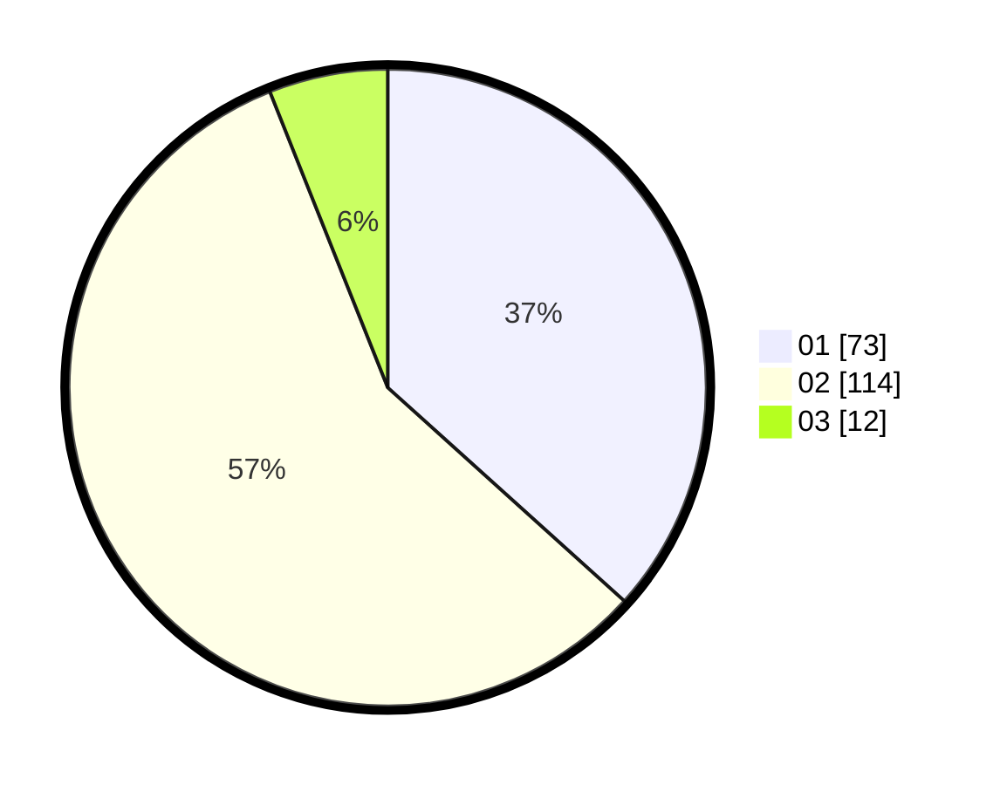

# Hasil

Hasil perolehan suara paslon dapat dilihat pada file paslon-01.txt, paslon-02.txt, dan paslon-03.txt.

Jika tidak ada, artinya data tersebut belum ada pada SIREKAP.

## Perolehan Suara

 * Paslon 01: **73**.
 * Paslon 02: **114**.
 * Paslon 03: **12**.

## Foto C Plano

https://sirekap-obj-formc.kpu.go.id/2df1/pemilu/ppwp/31/73/06/10/01/3173061001209-20240216-142312--331ccb5a-f81e-4850-b4b1-6414c1421c33.jpg

https://sirekap-obj-formc.kpu.go.id/2df1/pemilu/ppwp/31/73/06/10/01/3173061001209-20240216-142313--f8fba017-ac27-4cf7-b17b-8cd4d3255756.jpg

https://sirekap-obj-formc.kpu.go.id/2df1/pemilu/ppwp/31/73/06/10/01/3173061001209-20240216-142312--99648cac-400e-4fa8-8727-3cc556d1ee50.jpg

## DATA PEMILIH TETAP

Jumlah pemilih dalam DPT: **272**.
 * L: **141**.
 * P: **131**.

## DATA PENGGUNA HAK PILIH

Jumlah pengguna hak pilih dalam DPT: **196**.
 * L: **103**.
 * P: **93**.

Jumlah pengguna hak pilih dalam DPTb: **2**.
 * L: **0**.
 * P: **2**.

Jumlah pengguna hak pilih dalam DPK: **3**.
 * L: **2**.
 * P: **1**.

Jumlah pengguna hak pilih: **201**.
 * L: **105**.
 * P: **96**.

## JUMLAH SUARA SAH DAN TIDAK SAH

JUMLAH SELURUH SUARA SAH: **199**.

JUMLAH SUARA TIDAK SAH: **2**.

JUMLAH SELURUH SUARA SAH DAN SUARA TIDAK SAH: **201**.
