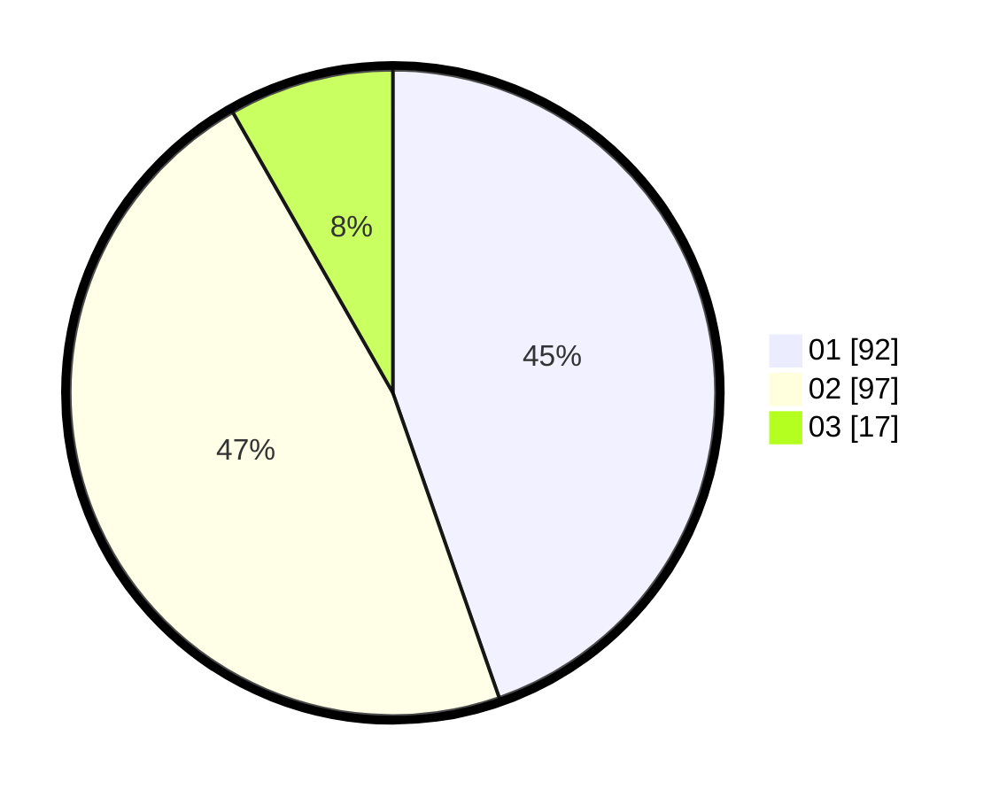

# Hasil

Hasil perolehan suara paslon dapat dilihat pada file paslon-01.txt, paslon-02.txt, dan paslon-03.txt.

Jika tidak ada, artinya data tersebut belum ada pada SIREKAP.

## Perolehan Suara

 * Paslon 01: **92**.
 * Paslon 02: **97**.
 * Paslon 03: **17**.

## Foto C Plano

https://sirekap-obj-formc.kpu.go.id/1ec7/pemilu/ppwp/31/73/06/10/01/3173061001211-20240214-231149--59afc498-50b1-41c3-8db1-65ae2f9cdd79.jpg

https://sirekap-obj-formc.kpu.go.id/1ec7/pemilu/ppwp/31/73/06/10/01/3173061001211-20240214-212642--6a448487-7870-4e6d-97a0-3ac31fce1f91.jpg

https://sirekap-obj-formc.kpu.go.id/1ec7/pemilu/ppwp/31/73/06/10/01/3173061001211-20240214-212438--fec9cc01-c67d-4ab7-87aa-fa661088e372.jpg
