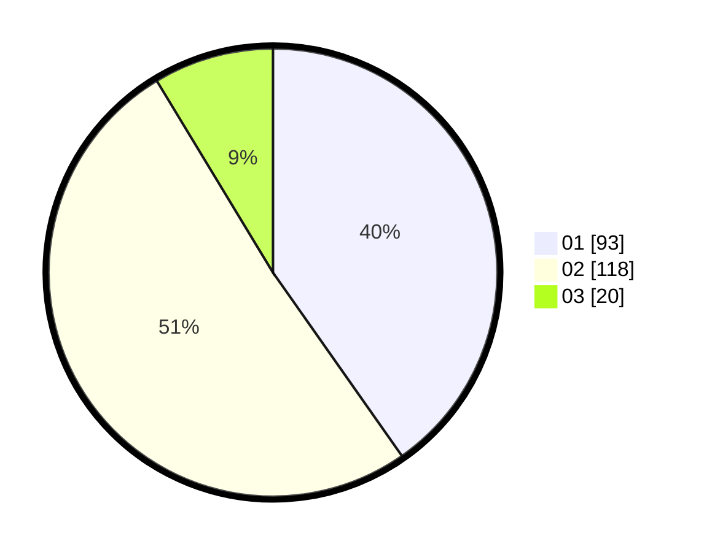

# Hasil

Hasil perolehan suara paslon dapat dilihat pada file paslon-01.txt, paslon-02.txt, dan paslon-03.txt.

Jika tidak ada, artinya data tersebut belum ada pada SIREKAP.

## Perolehan Suara

 * Paslon 01: **93**.
 * Paslon 02: **118**.
 * Paslon 03: **20**.

## Foto C Plano

https://sirekap-obj-formc.kpu.go.id/72da/pemilu/ppwp/31/73/06/10/01/3173061001212-20240216-020739--4c4802f1-f134-4d20-af73-9091ccf84655.jpg

https://sirekap-obj-formc.kpu.go.id/72da/pemilu/ppwp/31/73/06/10/01/3173061001212-20240214-201016--4d7215e3-9b10-412e-b1c7-cd35021f0a5d.jpg

https://sirekap-obj-formc.kpu.go.id/72da/pemilu/ppwp/31/73/06/10/01/3173061001212-20240216-015121--8588a14b-5b90-4b76-867d-bbdfe3a6842e.jpg

## DATA PEMILIH TETAP

Jumlah pemilih dalam DPT: **293**.
 * L: **152**.
 * P: **141**.

## DATA PENGGUNA HAK PILIH

Jumlah pengguna hak pilih dalam DPT: **238**.
 * L: **117**.
 * P: **113**.

Jumlah pengguna hak pilih dalam DPTb: **2**.
 * L: **1**.
 * P: **1**.

Jumlah pengguna hak pilih dalam DPK: **0**.
 * L: **0**.
 * P: **0**.

Jumlah pengguna hak pilih: **232**.
 * L: **118**.
 * P: **114**.

## JUMLAH SUARA SAH DAN TIDAK SAH

JUMLAH SELURUH SUARA SAH: **231**.

JUMLAH SUARA TIDAK SAH: **1**.

JUMLAH SELURUH SUARA SAH DAN SUARA TIDAK SAH: **232**.
