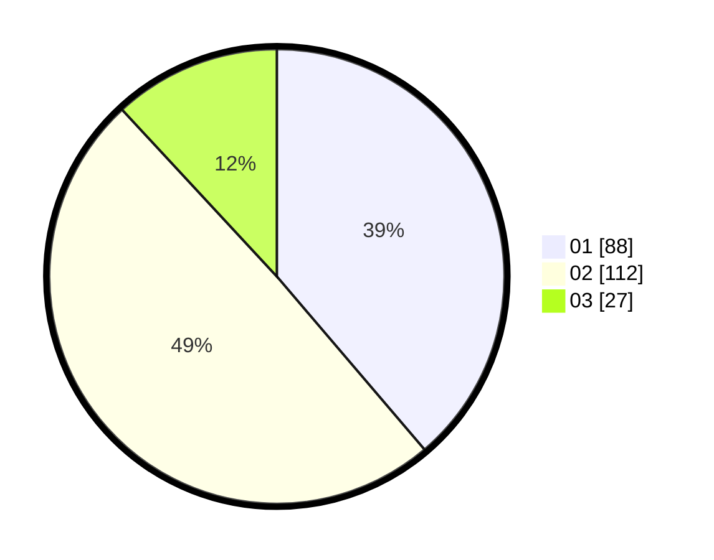

# Hasil

Hasil perolehan suara paslon dapat dilihat pada file paslon-01.txt, paslon-02.txt, dan paslon-03.txt.

Jika tidak ada, artinya data tersebut belum ada pada SIREKAP.

## Perolehan Suara

 * Paslon 01: **88**.
 * Paslon 02: **112**.
 * Paslon 03: **27**.

## Foto C Plano

https://sirekap-obj-formc.kpu.go.id/d99b/pemilu/ppwp/31/73/06/10/01/3173061001213-20240214-232012--c72fb740-378a-43e8-a0b1-7e202d6cd65c.jpg

https://sirekap-obj-formc.kpu.go.id/d99b/pemilu/ppwp/31/73/06/10/01/3173061001213-20240214-231649--81eab785-55d1-4d29-a50c-fa12aa9fadd4.jpg

https://sirekap-obj-formc.kpu.go.id/d99b/pemilu/ppwp/31/73/06/10/01/3173061001213-20240214-232117--b540d1ac-7c1d-40e4-be12-cf78254e0b36.jpg
