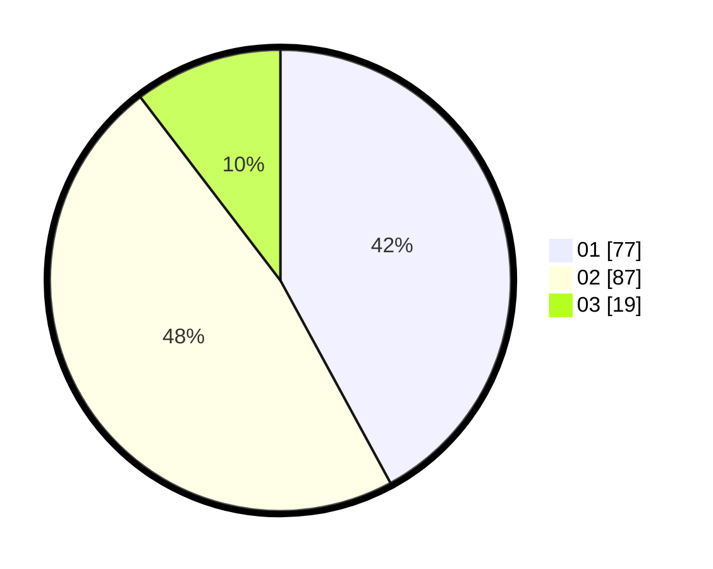

# Hasil

Hasil perolehan suara paslon dapat dilihat pada file paslon-01.txt, paslon-02.txt, dan paslon-03.txt.

Jika tidak ada, artinya data tersebut belum ada pada SIREKAP.

## Perolehan Suara

 * Paslon 01: **77**.
 * Paslon 02: **87**.
 * Paslon 03: **19**.

## Foto C Plano

https://sirekap-obj-formc.kpu.go.id/4c85/pemilu/ppwp/31/73/06/10/01/3173061001215-20240214-190642--7b24ad1a-2b56-4c10-acca-861be1b27b4b.jpg

https://sirekap-obj-formc.kpu.go.id/4c85/pemilu/ppwp/31/73/06/10/01/3173061001215-20240214-191323--2a5e93cd-c915-4255-84e8-d1f96796c50d.jpg

https://sirekap-obj-formc.kpu.go.id/4c85/pemilu/ppwp/31/73/06/10/01/3173061001215-20240214-191901--137145e5-6164-4c7b-9a29-9baf2a062610.jpg

## DATA PEMILIH TETAP

Jumlah pemilih dalam DPT: **225**.
 * L: **112**.
 * P: **113**.

## DATA PENGGUNA HAK PILIH

Jumlah pengguna hak pilih dalam DPT: **184**.
 * L: **88**.
 * P: **96**.

Jumlah pengguna hak pilih dalam DPTb: **0**.
 * L: **0**.
 * P: **0**.

Jumlah pengguna hak pilih dalam DPK: **0**.
 * L: **0**.
 * P: **0**.

Jumlah pengguna hak pilih: **184**.
 * L: **88**.
 * P: **96**.

## JUMLAH SUARA SAH DAN TIDAK SAH

JUMLAH SELURUH SUARA SAH: **183**.

JUMLAH SUARA TIDAK SAH: **1**.

JUMLAH SELURUH SUARA SAH DAN SUARA TIDAK SAH: **184**.
