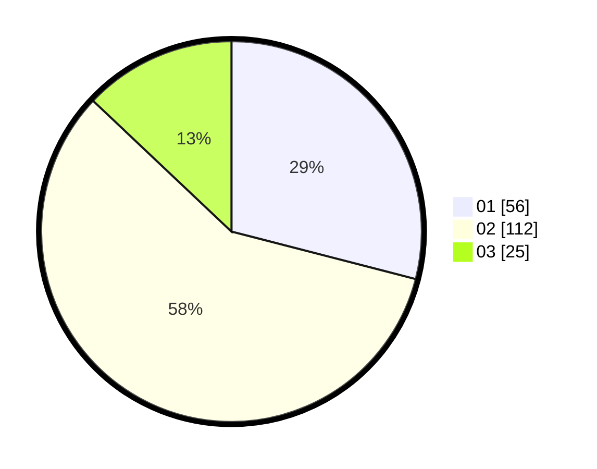

# Hasil

Hasil perolehan suara paslon dapat dilihat pada file paslon-01.txt, paslon-02.txt, dan paslon-03.txt.

Jika tidak ada, artinya data tersebut belum ada pada SIREKAP.

## Perolehan Suara

 * Paslon 01: **56**.
 * Paslon 02: **112**.
 * Paslon 03: **25**.

## Foto C Plano

https://sirekap-obj-formc.kpu.go.id/4d0c/pemilu/ppwp/31/73/06/10/01/3173061001220-20240215-213254--8de22def-d12d-4733-b8d1-e57c8149bebf.jpg

https://sirekap-obj-formc.kpu.go.id/4d0c/pemilu/ppwp/31/73/06/10/01/3173061001220-20240215-213255--c4fe32fd-9b91-4cc8-a6fb-4d1ef4d42a1e.jpg

https://sirekap-obj-formc.kpu.go.id/4d0c/pemilu/ppwp/31/73/06/10/01/3173061001220-20240215-213254--a6dba3d3-7f64-441d-b26c-ac2ec377fef2.jpg

## DATA PEMILIH TETAP

Jumlah pemilih dalam DPT: **261**.
 * L: **142**.
 * P: **119**.

## DATA PENGGUNA HAK PILIH

Jumlah pengguna hak pilih dalam DPT: **194**.
 * L: **98**.
 * P: **96**.

Jumlah pengguna hak pilih dalam DPTb: **0**.
 * L: **0**.
 * P: **0**.

Jumlah pengguna hak pilih dalam DPK: **2**.
 * L: **1**.
 * P: **1**.

Jumlah pengguna hak pilih: **196**.
 * L: **99**.
 * P: **97**.

## JUMLAH SUARA SAH DAN TIDAK SAH

JUMLAH SELURUH SUARA SAH: **193**.

JUMLAH SUARA TIDAK SAH: **3**.

JUMLAH SELURUH SUARA SAH DAN SUARA TIDAK SAH: **196**.
