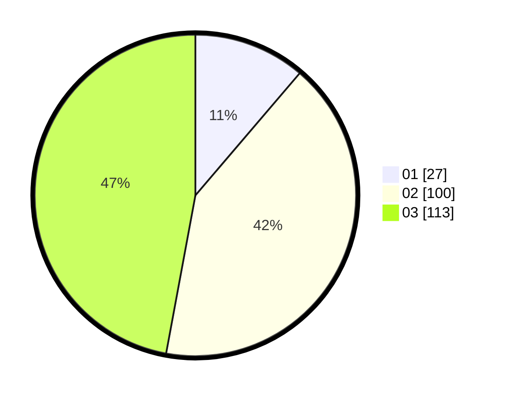

# Hasil

Hasil perolehan suara paslon dapat dilihat pada file paslon-01.txt, paslon-02.txt, dan paslon-03.txt.

Jika tidak ada, artinya data tersebut belum ada pada SIREKAP.

## Perolehan Suara

 * Paslon 01: **27**.
 * Paslon 02: **100**.
 * Paslon 03: **113**.

## Foto C Plano

https://sirekap-obj-formc.kpu.go.id/efb3/pemilu/ppwp/31/73/06/10/01/3173061001221-20240214-195518--ae7dd252-dc93-4958-a60e-4e076188dc9c.jpg

https://sirekap-obj-formc.kpu.go.id/efb3/pemilu/ppwp/31/73/06/10/01/3173061001221-20240214-195520--43cf3189-67d4-4f1d-90fb-8efa637f1e2c.jpg

https://sirekap-obj-formc.kpu.go.id/efb3/pemilu/ppwp/31/73/06/10/01/3173061001221-20240214-195523--fb2c6f01-889f-43f0-8d5c-ed93bb3de86a.jpg

## DATA PEMILIH TETAP

Jumlah pemilih dalam DPT: **286**.
 * L: **130**.
 * P: **156**.

## DATA PENGGUNA HAK PILIH

Jumlah pengguna hak pilih dalam DPT: **243**.
 * L: **108**.
 * P: **135**.

Jumlah pengguna hak pilih dalam DPTb: **3**.
 * L: **0**.
 * P: **3**.

Jumlah pengguna hak pilih dalam DPK: **3**.
 * L: **1**.
 * P: **2**.

Jumlah pengguna hak pilih: **249**.
 * L: **109**.
 * P: **140**.

## JUMLAH SUARA SAH DAN TIDAK SAH

JUMLAH SELURUH SUARA SAH: **240**.

JUMLAH SUARA TIDAK SAH: **9**.

JUMLAH SELURUH SUARA SAH DAN SUARA TIDAK SAH: **249**.
