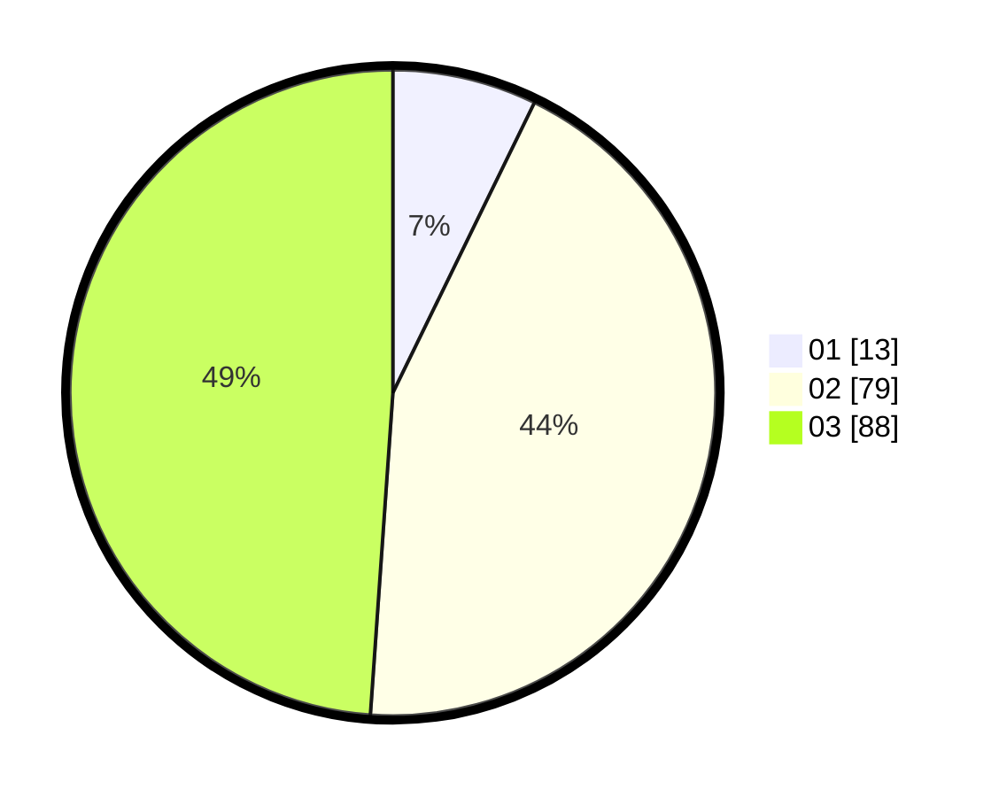

# Hasil

Hasil perolehan suara paslon dapat dilihat pada file paslon-01.txt, paslon-02.txt, dan paslon-03.txt.

Jika tidak ada, artinya data tersebut belum ada pada SIREKAP.

## Perolehan Suara

 * Paslon 01: **13**.
 * Paslon 02: **79**.
 * Paslon 03: **88**.

## Foto C Plano

https://sirekap-obj-formc.kpu.go.id/caa9/pemilu/ppwp/31/73/06/10/01/3173061001222-20240215-205214--2b8bb381-e01f-4a6c-bff9-764ab29fc834.jpg

https://sirekap-obj-formc.kpu.go.id/caa9/pemilu/ppwp/31/73/06/10/01/3173061001222-20240215-205217--35e03043-811c-4ce9-957e-2252dd5f68da.jpg

https://sirekap-obj-formc.kpu.go.id/caa9/pemilu/ppwp/31/73/06/10/01/3173061001222-20240215-205216--4bbbe9af-8c6f-4804-9c90-05d372bf8e6a.jpg

## DATA PEMILIH TETAP

Jumlah pemilih dalam DPT: **208**.
 * L: **95**.
 * P: **113**.

## DATA PENGGUNA HAK PILIH

Jumlah pengguna hak pilih dalam DPT: **170**.
 * L: **83**.
 * P: **87**.

Jumlah pengguna hak pilih dalam DPTb: **10**.
 * L: **2**.
 * P: **8**.

Jumlah pengguna hak pilih dalam DPK: **2**.
 * L: **1**.
 * P: **1**.

Jumlah pengguna hak pilih: **182**.
 * L: **86**.
 * P: **96**.

## JUMLAH SUARA SAH DAN TIDAK SAH

JUMLAH SELURUH SUARA SAH: **180**.

JUMLAH SUARA TIDAK SAH: **2**.

JUMLAH SELURUH SUARA SAH DAN SUARA TIDAK SAH: **182**.
