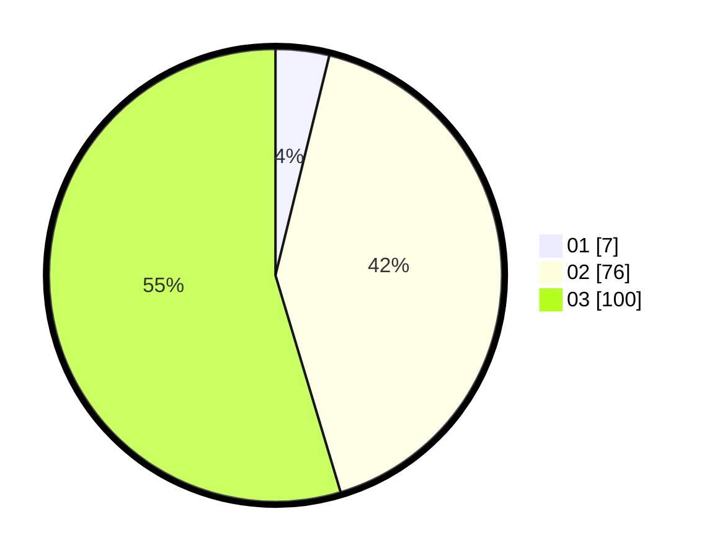

# Hasil

Hasil perolehan suara paslon dapat dilihat pada file paslon-01.txt, paslon-02.txt, dan paslon-03.txt.

Jika tidak ada, artinya data tersebut belum ada pada SIREKAP.

## Perolehan Suara

 * Paslon 01: **7**.
 * Paslon 02: **76**.
 * Paslon 03: **100**.

## Foto C Plano

https://sirekap-obj-formc.kpu.go.id/7a93/pemilu/ppwp/31/73/06/10/01/3173061001223-20240215-223551--89680ec8-9f90-4d80-b21e-a28ea3c0b910.jpg

https://sirekap-obj-formc.kpu.go.id/7a93/pemilu/ppwp/31/73/06/10/01/3173061001223-20240214-155407--7bb94cc6-9751-42e1-ba81-1d48b5f4e28e.jpg

https://sirekap-obj-formc.kpu.go.id/7a93/pemilu/ppwp/31/73/06/10/01/3173061001223-20240214-155521--7a13236d-a965-41b3-8265-ba3642504185.jpg

## DATA PEMILIH TETAP

Jumlah pemilih dalam DPT: **247**.
 * L: **125**.
 * P: **122**.

## DATA PENGGUNA HAK PILIH

Jumlah pengguna hak pilih dalam DPT: **179**.
 * L: **88**.
 * P: **91**.

Jumlah pengguna hak pilih dalam DPTb: **5**.
 * L: **2**.
 * P: **3**.

Jumlah pengguna hak pilih dalam DPK: **2**.
 * L: **1**.
 * P: **1**.

Jumlah pengguna hak pilih: **186**.
 * L: **91**.
 * P: **95**.

## JUMLAH SUARA SAH DAN TIDAK SAH

JUMLAH SELURUH SUARA SAH: **183**.

JUMLAH SUARA TIDAK SAH: **3**.

JUMLAH SELURUH SUARA SAH DAN SUARA TIDAK SAH: **186**.
