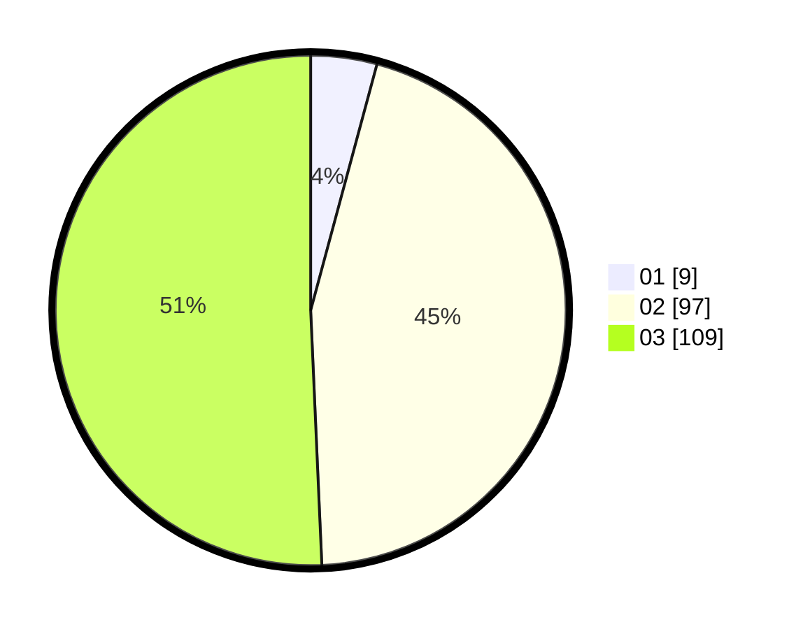

# Hasil

Hasil perolehan suara paslon dapat dilihat pada file paslon-01.txt, paslon-02.txt, dan paslon-03.txt.

Jika tidak ada, artinya data tersebut belum ada pada SIREKAP.

## Perolehan Suara

 * Paslon 01: **9**.
 * Paslon 02: **97**.
 * Paslon 03: **109**.

## Foto C Plano

https://sirekap-obj-formc.kpu.go.id/db93/pemilu/ppwp/31/73/06/10/01/3173061001224-20240214-190011--ed8441e4-0f91-4e94-810e-6b524a540d39.jpg

https://sirekap-obj-formc.kpu.go.id/db93/pemilu/ppwp/31/73/06/10/01/3173061001224-20240214-190028--730fda97-17c3-4cb8-baaa-ee68c296c7c7.jpg

https://sirekap-obj-formc.kpu.go.id/db93/pemilu/ppwp/31/73/06/10/01/3173061001224-20240214-190043--4f6e389d-2b2d-4116-896a-01a674fba8f4.jpg

## DATA PEMILIH TETAP

Jumlah pemilih dalam DPT: **291**.
 * L: **137**.
 * P: **154**.

## DATA PENGGUNA HAK PILIH

Jumlah pengguna hak pilih dalam DPT: **209**.
 * L: **98**.
 * P: **111**.

Jumlah pengguna hak pilih dalam DPTb: **7**.
 * L: **3**.
 * P: **4**.

Jumlah pengguna hak pilih dalam DPK: **3**.
 * L: **2**.
 * P: **1**.

Jumlah pengguna hak pilih: **219**.
 * L: **103**.
 * P: **116**.

## JUMLAH SUARA SAH DAN TIDAK SAH

JUMLAH SELURUH SUARA SAH: **215**.

JUMLAH SUARA TIDAK SAH: **4**.

JUMLAH SELURUH SUARA SAH DAN SUARA TIDAK SAH: **219**.
