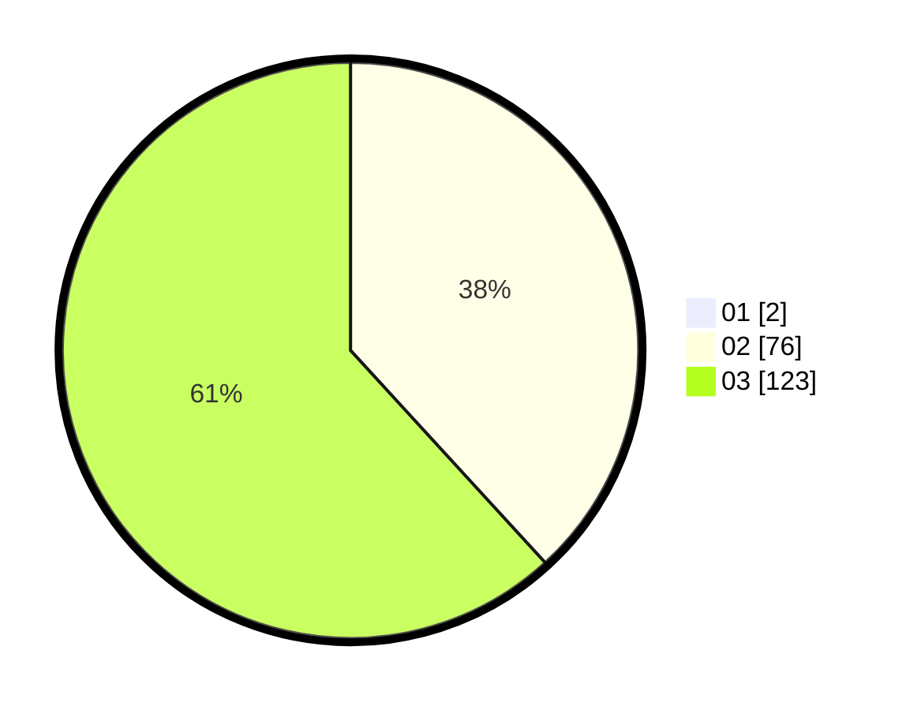

# Hasil

Hasil perolehan suara paslon dapat dilihat pada file paslon-01.txt, paslon-02.txt, dan paslon-03.txt.

Jika tidak ada, artinya data tersebut belum ada pada SIREKAP.

## Perolehan Suara

 * Paslon 01: **2**.
 * Paslon 02: **76**.
 * Paslon 03: **123**.

## Foto C Plano

https://sirekap-obj-formc.kpu.go.id/f6ed/pemilu/ppwp/31/73/06/10/01/3173061001228-20240215-230655--5923da02-22d7-47e0-8719-1c46526031b7.jpg

https://sirekap-obj-formc.kpu.go.id/f6ed/pemilu/ppwp/31/73/06/10/01/3173061001228-20240215-230659--b6bb35c1-4ace-4b46-b976-b0dc4acd7421.jpg

https://sirekap-obj-formc.kpu.go.id/f6ed/pemilu/ppwp/31/73/06/10/01/3173061001228-20240215-230658--f0dcc358-7421-4256-8e8a-fd18312c3bc7.jpg

## DATA PEMILIH TETAP

Jumlah pemilih dalam DPT: **281**.
 * L: **127**.
 * P: **154**.

## DATA PENGGUNA HAK PILIH

Jumlah pengguna hak pilih dalam DPT: **201**.
 * L: **96**.
 * P: **105**.

Jumlah pengguna hak pilih dalam DPTb: **1**.
 * L: **0**.
 * P: **1**.

Jumlah pengguna hak pilih dalam DPK: **2**.
 * L: **0**.
 * P: **2**.

Jumlah pengguna hak pilih: **204**.
 * L: **96**.
 * P: **108**.

## JUMLAH SUARA SAH DAN TIDAK SAH

JUMLAH SELURUH SUARA SAH: **201**.

JUMLAH SUARA TIDAK SAH: **3**.

JUMLAH SELURUH SUARA SAH DAN SUARA TIDAK SAH: **204**.
