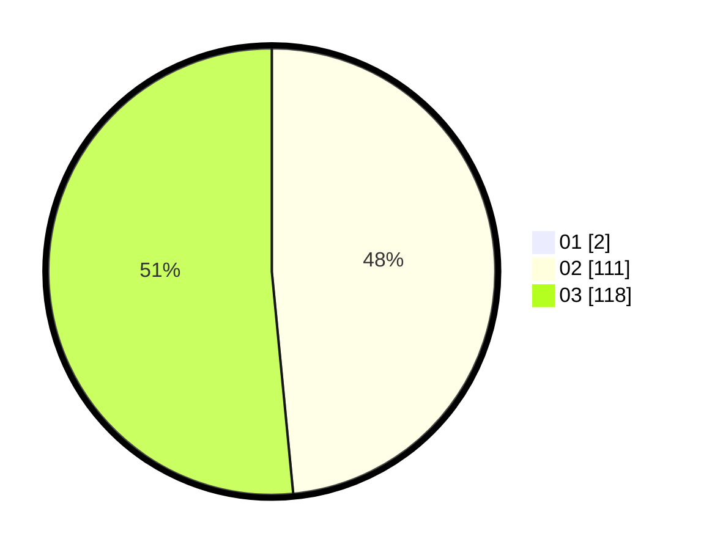

# Hasil

Hasil perolehan suara paslon dapat dilihat pada file paslon-01.txt, paslon-02.txt, dan paslon-03.txt.

Jika tidak ada, artinya data tersebut belum ada pada SIREKAP.

## Perolehan Suara

 * Paslon 01: **2**.
 * Paslon 02: **111**.
 * Paslon 03: **118**.

## Foto C Plano

https://sirekap-obj-formc.kpu.go.id/a3b9/pemilu/ppwp/31/73/06/10/01/3173061001231-20240214-204850--9191fb90-e1d3-4ed8-a6da-13a28f1e0f3c.jpg

https://sirekap-obj-formc.kpu.go.id/a3b9/pemilu/ppwp/31/73/06/10/01/3173061001231-20240217-141817--a9786f2c-7f6a-4be4-a22e-ee3f151a2d7c.jpg

https://sirekap-obj-formc.kpu.go.id/a3b9/pemilu/ppwp/31/73/06/10/01/3173061001231-20240214-205010--4bf8c90a-568a-43ff-8d09-bf832253189a.jpg

## DATA PEMILIH TETAP

Jumlah pemilih dalam DPT: **278**.
 * L: **128**.
 * P: **150**.

## DATA PENGGUNA HAK PILIH

Jumlah pengguna hak pilih dalam DPT: **222**.
 * L: **103**.
 * P: **119**.

Jumlah pengguna hak pilih dalam DPTb: **5**.
 * L: **1**.
 * P: **4**.

Jumlah pengguna hak pilih dalam DPK: **6**.
 * L: **4**.
 * P: **2**.

Jumlah pengguna hak pilih: **233**.
 * L: **108**.
 * P: **125**.

## JUMLAH SUARA SAH DAN TIDAK SAH

JUMLAH SELURUH SUARA SAH: **231**.

JUMLAH SUARA TIDAK SAH: **2**.

JUMLAH SELURUH SUARA SAH DAN SUARA TIDAK SAH: **233**.
