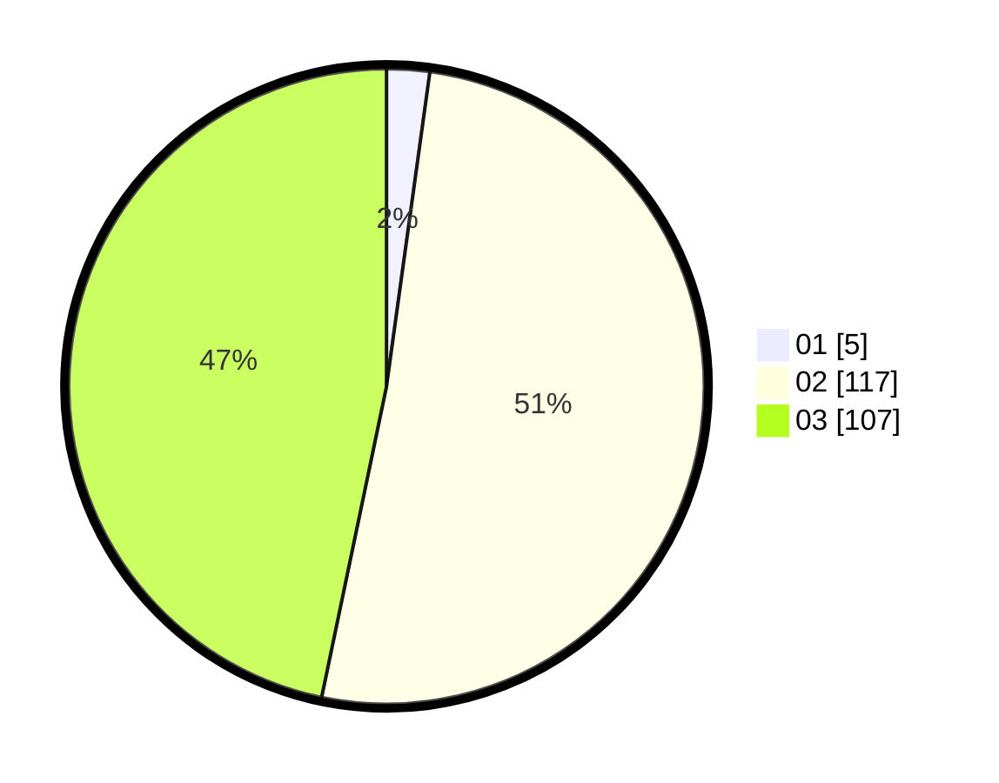

# Hasil

Hasil perolehan suara paslon dapat dilihat pada file paslon-01.txt, paslon-02.txt, dan paslon-03.txt.

Jika tidak ada, artinya data tersebut belum ada pada SIREKAP.

## Perolehan Suara

 * Paslon 01: **5**.
 * Paslon 02: **117**.
 * Paslon 03: **107**.

## Foto C Plano

https://sirekap-obj-formc.kpu.go.id/dc11/pemilu/ppwp/31/73/06/10/01/3173061001233-20240214-224514--98ed240e-0ba3-4064-9f4f-9bbf679cd4d3.jpg

https://sirekap-obj-formc.kpu.go.id/dc11/pemilu/ppwp/31/73/06/10/01/3173061001233-20240214-224630--71a9a44d-17e7-41f9-8667-82fc68717aa1.jpg
