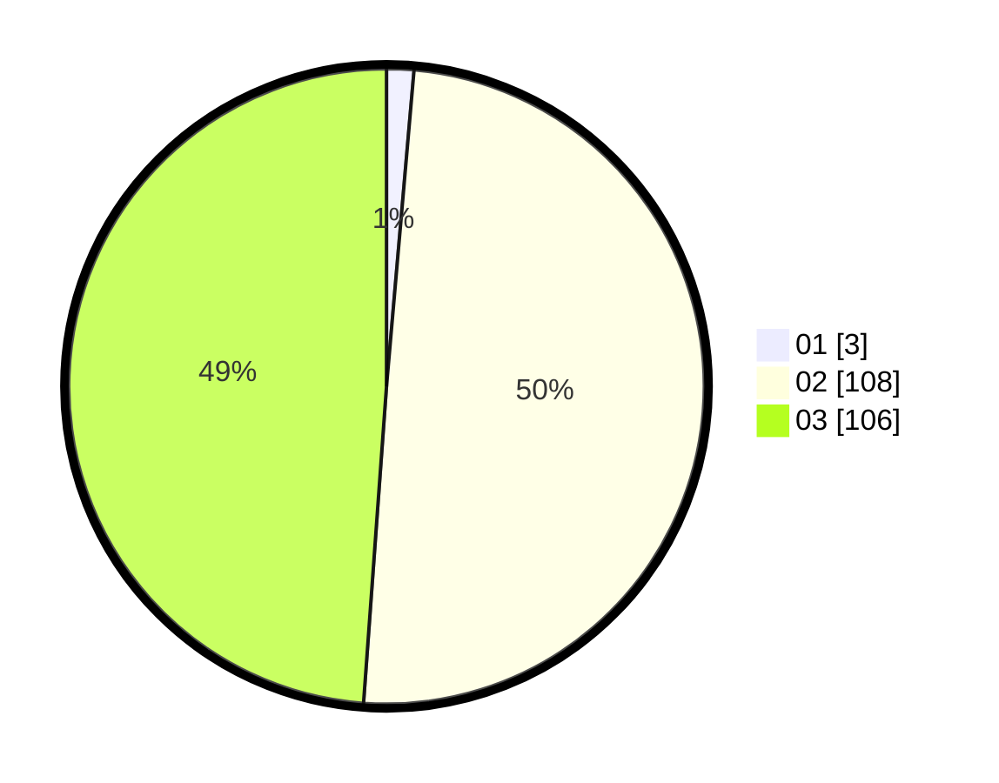

# Hasil

Hasil perolehan suara paslon dapat dilihat pada file paslon-01.txt, paslon-02.txt, dan paslon-03.txt.

Jika tidak ada, artinya data tersebut belum ada pada SIREKAP.

## Perolehan Suara

 * Paslon 01: **3**.
 * Paslon 02: **108**.
 * Paslon 03: **106**.

## Foto C Plano

https://sirekap-obj-formc.kpu.go.id/e78e/pemilu/ppwp/31/73/06/10/01/3173061001234-20240216-130917--b1920247-903b-47b5-a93d-ff88bd851a6a.jpg

https://sirekap-obj-formc.kpu.go.id/e78e/pemilu/ppwp/31/73/06/10/01/3173061001234-20240216-130919--e5e10673-7467-440d-8377-bcf84b7d668a.jpg

https://sirekap-obj-formc.kpu.go.id/e78e/pemilu/ppwp/31/73/06/10/01/3173061001234-20240216-130918--6d86d64b-f845-4f49-a56f-21c2cb637c40.jpg

## DATA PEMILIH TETAP

Jumlah pemilih dalam DPT: **215**.
 * L: **100**.
 * P: **115**.

## DATA PENGGUNA HAK PILIH

Jumlah pengguna hak pilih dalam DPT: **215**.
 * L: **100**.
 * P: **115**.

Jumlah pengguna hak pilih dalam DPTb: **2**.
 * L: **0**.
 * P: **2**.

Jumlah pengguna hak pilih dalam DPK: **5**.
 * L: **3**.
 * P: **2**.

Jumlah pengguna hak pilih: **222**.
 * L: **103**.
 * P: **119**.

## JUMLAH SUARA SAH DAN TIDAK SAH

JUMLAH SELURUH SUARA SAH: **217**.

JUMLAH SUARA TIDAK SAH: **5**.

JUMLAH SELURUH SUARA SAH DAN SUARA TIDAK SAH: **222**.
