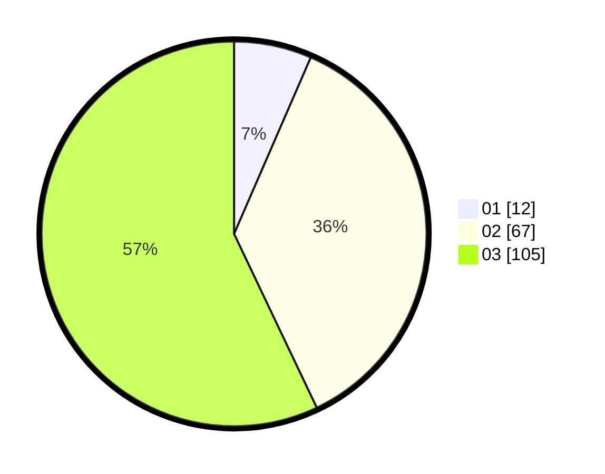

# Hasil

Hasil perolehan suara paslon dapat dilihat pada file paslon-01.txt, paslon-02.txt, dan paslon-03.txt.

Jika tidak ada, artinya data tersebut belum ada pada SIREKAP.

## Perolehan Suara

 * Paslon 01: **12**.
 * Paslon 02: **67**.
 * Paslon 03: **105**.

## Foto C Plano

https://sirekap-obj-formc.kpu.go.id/67db/pemilu/ppwp/31/73/06/10/01/3173061001238-20240214-204551--e79dcce8-5287-4ae1-8482-cba0000b2acb.jpg

https://sirekap-obj-formc.kpu.go.id/67db/pemilu/ppwp/31/73/06/10/01/3173061001238-20240215-001955--639c6837-c954-471d-ab16-525683b75c90.jpg

https://sirekap-obj-formc.kpu.go.id/67db/pemilu/ppwp/31/73/06/10/01/3173061001238-20240215-002044--253b9e3d-47c9-467e-af5f-67c5a88fbbe3.jpg
