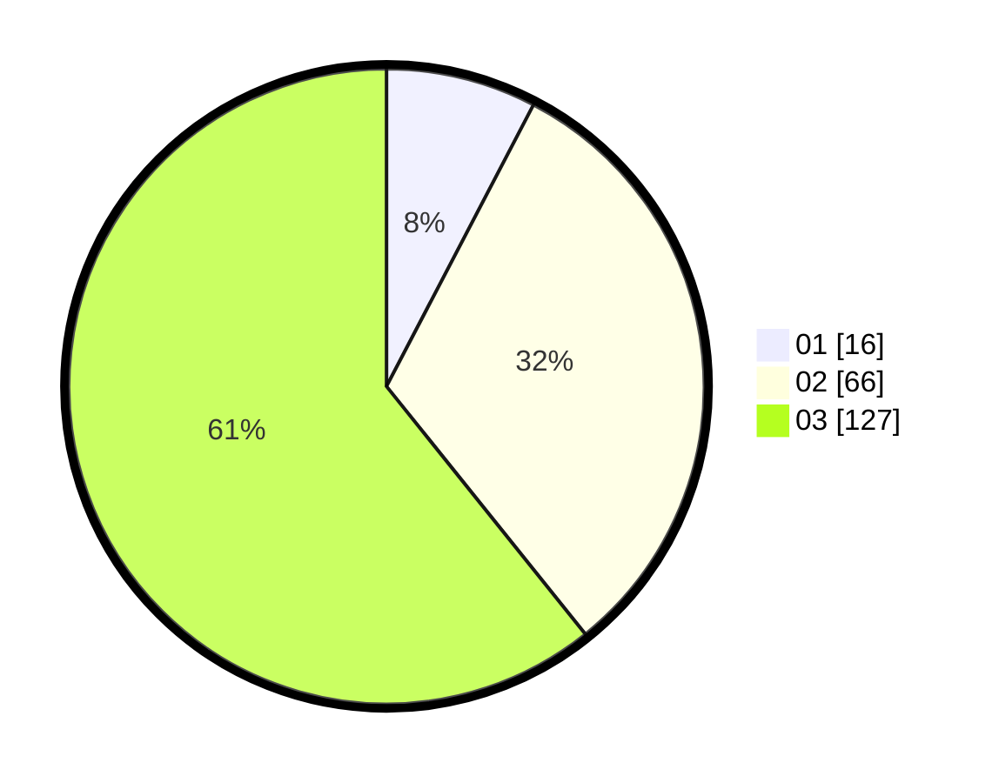

# Hasil

Hasil perolehan suara paslon dapat dilihat pada file paslon-01.txt, paslon-02.txt, dan paslon-03.txt.

Jika tidak ada, artinya data tersebut belum ada pada SIREKAP.

## Perolehan Suara

 * Paslon 01: **16**.
 * Paslon 02: **66**.
 * Paslon 03: **127**.

## Foto C Plano

https://sirekap-obj-formc.kpu.go.id/364a/pemilu/ppwp/31/73/06/10/01/3173061001239-20240214-202444--5ebb9bb4-8ce9-4fab-bf9e-e292bb6d5441.jpg

https://sirekap-obj-formc.kpu.go.id/364a/pemilu/ppwp/31/73/06/10/01/3173061001239-20240214-210459--219023f2-dfc1-4dd0-bb32-9e647b602d4b.jpg

https://sirekap-obj-formc.kpu.go.id/364a/pemilu/ppwp/31/73/06/10/01/3173061001239-20240214-202624--adf93664-f19b-454c-97a4-d80778ef13b9.jpg

## DATA PEMILIH TETAP

Jumlah pemilih dalam DPT: **269**.
 * L: **123**.
 * P: **146**.

## DATA PENGGUNA HAK PILIH

Jumlah pengguna hak pilih dalam DPT: **188**.
 * L: **88**.
 * P: **100**.

Jumlah pengguna hak pilih dalam DPTb: **11**.
 * L: **5**.
 * P: **6**.

Jumlah pengguna hak pilih dalam DPK: **10**.
 * L: **4**.
 * P: **6**.

Jumlah pengguna hak pilih: **209**.
 * L: **97**.
 * P: **112**.

## JUMLAH SUARA SAH DAN TIDAK SAH

JUMLAH SELURUH SUARA SAH: **209**.

JUMLAH SUARA TIDAK SAH: **0**.

JUMLAH SELURUH SUARA SAH DAN SUARA TIDAK SAH: **209**.
