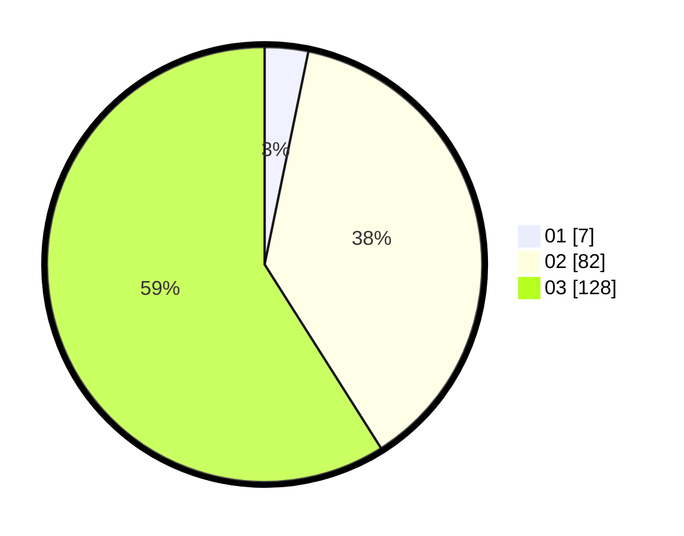

# Hasil

Hasil perolehan suara paslon dapat dilihat pada file paslon-01.txt, paslon-02.txt, dan paslon-03.txt.

Jika tidak ada, artinya data tersebut belum ada pada SIREKAP.

## Perolehan Suara

 * Paslon 01: **7**.
 * Paslon 02: **82**.
 * Paslon 03: **128**.

## Foto C Plano

https://sirekap-obj-formc.kpu.go.id/3276/pemilu/ppwp/31/73/06/10/01/3173061001240-20240214-201939--aa763693-7cd2-46d6-9fb9-3bdd86a6d1e6.jpg

https://sirekap-obj-formc.kpu.go.id/3276/pemilu/ppwp/31/73/06/10/01/3173061001240-20240214-211217--7d6d980d-55ea-4fb7-9fa6-7b54e323c913.jpg

https://sirekap-obj-formc.kpu.go.id/3276/pemilu/ppwp/31/73/06/10/01/3173061001240-20240214-201739--429d420f-16b0-4c52-9d25-48d091b2b72f.jpg

## DATA PEMILIH TETAP

Jumlah pemilih dalam DPT: **273**.
 * L: **140**.
 * P: **133**.

## DATA PENGGUNA HAK PILIH

Jumlah pengguna hak pilih dalam DPT: **198**.
 * L: **104**.
 * P: **94**.

Jumlah pengguna hak pilih dalam DPTb: **17**.
 * L: **3**.
 * P: **14**.

Jumlah pengguna hak pilih dalam DPK: **2**.
 * L: **1**.
 * P: **1**.

Jumlah pengguna hak pilih: **217**.
 * L: **108**.
 * P: **109**.

## JUMLAH SUARA SAH DAN TIDAK SAH

JUMLAH SELURUH SUARA SAH: **217**.

JUMLAH SUARA TIDAK SAH: **0**.

JUMLAH SELURUH SUARA SAH DAN SUARA TIDAK SAH: **217**.
