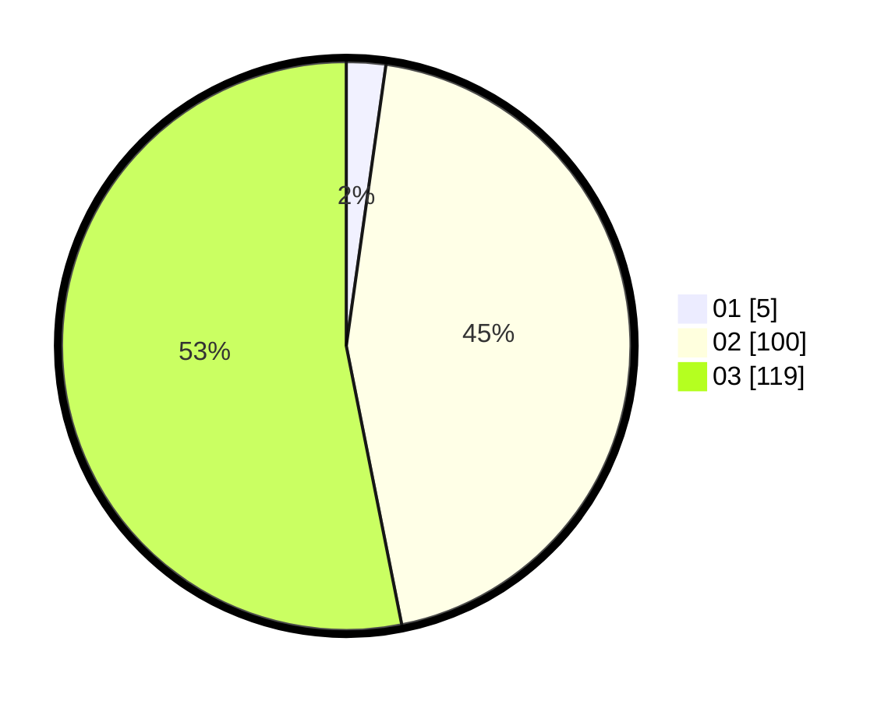

# Hasil

Hasil perolehan suara paslon dapat dilihat pada file paslon-01.txt, paslon-02.txt, dan paslon-03.txt.

Jika tidak ada, artinya data tersebut belum ada pada SIREKAP.

## Perolehan Suara

 * Paslon 01: **5**.
 * Paslon 02: **100**.
 * Paslon 03: **119**.

## Foto C Plano

https://sirekap-obj-formc.kpu.go.id/8fad/pemilu/ppwp/31/73/06/10/01/3173061001241-20240214-211225--1c2b87cf-32a4-44c7-957f-6c9933b3068e.jpg

https://sirekap-obj-formc.kpu.go.id/8fad/pemilu/ppwp/31/73/06/10/01/3173061001241-20240214-211601--08e8da2d-f1c8-4576-92c6-10546e15c01d.jpg

https://sirekap-obj-formc.kpu.go.id/8fad/pemilu/ppwp/31/73/06/10/01/3173061001241-20240214-211729--d2188541-c3c3-48a9-8f3f-40139b0b8471.jpg
