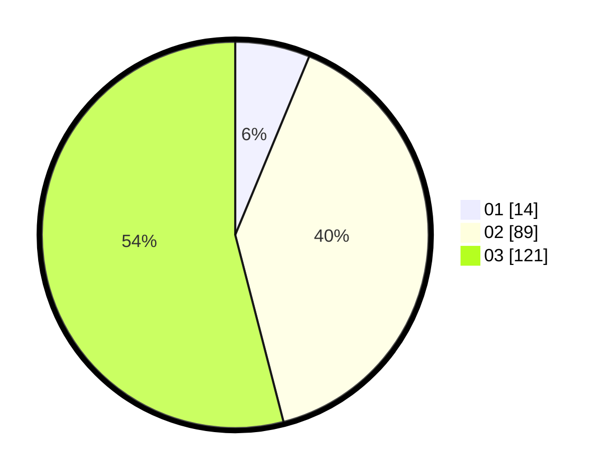

# Hasil

Hasil perolehan suara paslon dapat dilihat pada file paslon-01.txt, paslon-02.txt, dan paslon-03.txt.

Jika tidak ada, artinya data tersebut belum ada pada SIREKAP.

## Perolehan Suara

 * Paslon 01: **14**.
 * Paslon 02: **89**.
 * Paslon 03: **121**.

## Foto C Plano

https://sirekap-obj-formc.kpu.go.id/3bfc/pemilu/ppwp/31/73/06/10/01/3173061001244-20240214-191747--d90efd4e-91d0-416a-a86c-e1ea7c3aca9a.jpg

https://sirekap-obj-formc.kpu.go.id/3bfc/pemilu/ppwp/31/73/06/10/01/3173061001244-20240214-191843--0a3e30aa-9978-4837-8eed-10720a317c5e.jpg

https://sirekap-obj-formc.kpu.go.id/3bfc/pemilu/ppwp/31/73/06/10/01/3173061001244-20240214-191933--cd1b07b3-a042-4af2-b250-007b49723e1f.jpg

## DATA PEMILIH TETAP

Jumlah pemilih dalam DPT: **296**.
 * L: **136**.
 * P: **160**.

## DATA PENGGUNA HAK PILIH

Jumlah pengguna hak pilih dalam DPT: **210**.
 * L: **94**.
 * P: **116**.

Jumlah pengguna hak pilih dalam DPTb: **16**.
 * L: **4**.
 * P: **12**.

Jumlah pengguna hak pilih dalam DPK: **1**.
 * L: **1**.
 * P: **0**.

Jumlah pengguna hak pilih: **227**.
 * L: **99**.
 * P: **128**.

## JUMLAH SUARA SAH DAN TIDAK SAH

JUMLAH SELURUH SUARA SAH: **224**.

JUMLAH SUARA TIDAK SAH: **3**.

JUMLAH SELURUH SUARA SAH DAN SUARA TIDAK SAH: **227**.
