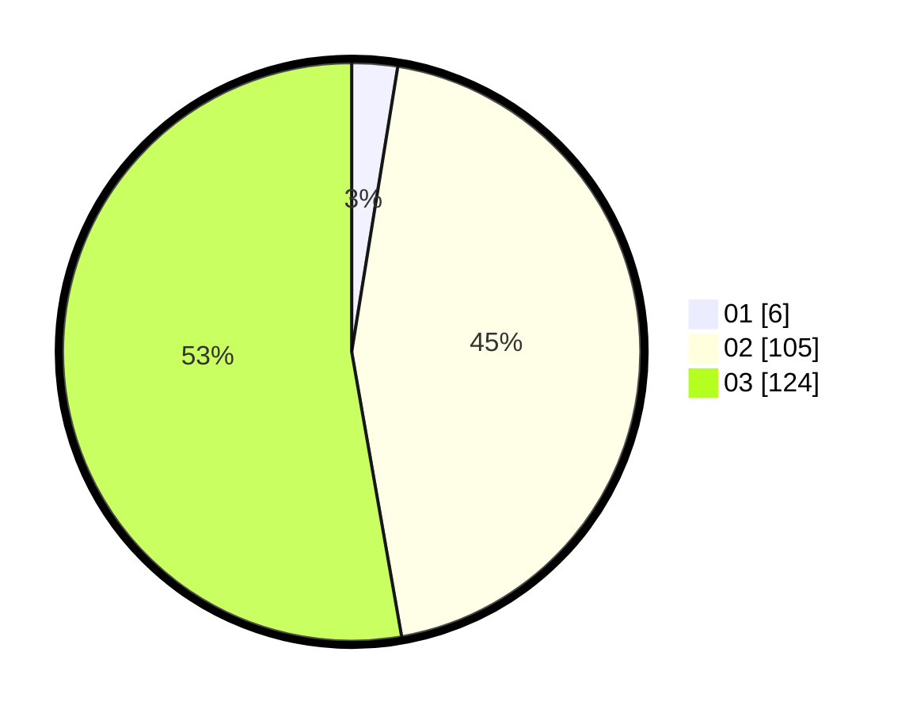

# Hasil

Hasil perolehan suara paslon dapat dilihat pada file paslon-01.txt, paslon-02.txt, dan paslon-03.txt.

Jika tidak ada, artinya data tersebut belum ada pada SIREKAP.

## Perolehan Suara

 * Paslon 01: **6**.
 * Paslon 02: **105**.
 * Paslon 03: **124**.

## Foto C Plano

https://sirekap-obj-formc.kpu.go.id/dce6/pemilu/ppwp/31/73/06/10/01/3173061001245-20240214-195840--fb1b6d7c-dcba-4ae5-99ba-ea03302d52c5.jpg

https://sirekap-obj-formc.kpu.go.id/dce6/pemilu/ppwp/31/73/06/10/01/3173061001245-20240214-200005--d6d862b9-eac7-4e2d-ab0c-de263762684d.jpg

https://sirekap-obj-formc.kpu.go.id/dce6/pemilu/ppwp/31/73/06/10/01/3173061001245-20240214-200102--60ef4a19-4a48-4108-8141-b3415436be49.jpg

## DATA PEMILIH TETAP

Jumlah pemilih dalam DPT: **280**.
 * L: **127**.
 * P: **153**.

## DATA PENGGUNA HAK PILIH

Jumlah pengguna hak pilih dalam DPT: **208**.
 * L: **94**.
 * P: **114**.

Jumlah pengguna hak pilih dalam DPTb: **23**.
 * L: **13**.
 * P: **10**.

Jumlah pengguna hak pilih dalam DPK: **6**.
 * L: **3**.
 * P: **3**.

Jumlah pengguna hak pilih: **237**.
 * L: **110**.
 * P: **127**.

## JUMLAH SUARA SAH DAN TIDAK SAH

JUMLAH SELURUH SUARA SAH: **235**.

JUMLAH SUARA TIDAK SAH: **2**.

JUMLAH SELURUH SUARA SAH DAN SUARA TIDAK SAH: **237**.
