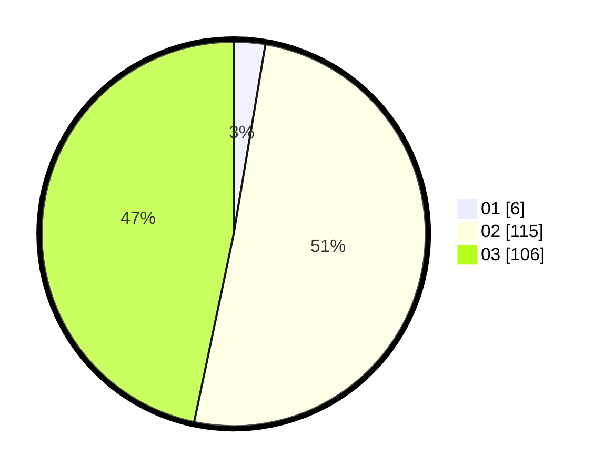

# Hasil

Hasil perolehan suara paslon dapat dilihat pada file paslon-01.txt, paslon-02.txt, dan paslon-03.txt.

Jika tidak ada, artinya data tersebut belum ada pada SIREKAP.

## Perolehan Suara

 * Paslon 01: **6**.
 * Paslon 02: **115**.
 * Paslon 03: **106**.

## Foto C Plano

https://sirekap-obj-formc.kpu.go.id/ea1b/pemilu/ppwp/31/73/06/10/01/3173061001246-20240214-225326--4b6824ee-29ef-49a7-8a9c-584100dc4e7f.jpg

https://sirekap-obj-formc.kpu.go.id/ea1b/pemilu/ppwp/31/73/06/10/01/3173061001246-20240214-220407--6f63c7f8-cdbc-49af-9b95-bddd0be998f3.jpg

https://sirekap-obj-formc.kpu.go.id/ea1b/pemilu/ppwp/31/73/06/10/01/3173061001246-20240214-212615--efa1f7fb-4695-42f9-bf8a-08c9e865dd6e.jpg
