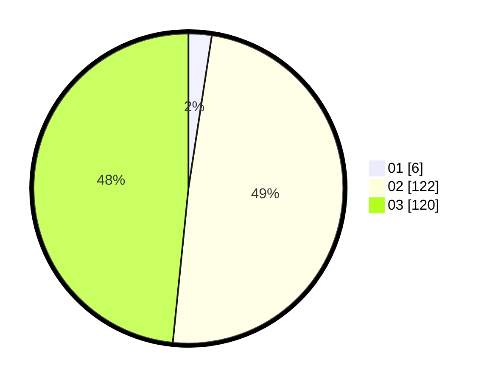

# Hasil

Hasil perolehan suara paslon dapat dilihat pada file paslon-01.txt, paslon-02.txt, dan paslon-03.txt.

Jika tidak ada, artinya data tersebut belum ada pada SIREKAP.

## Perolehan Suara

 * Paslon 01: **6**.
 * Paslon 02: **122**.
 * Paslon 03: **120**.

## Foto C Plano

https://sirekap-obj-formc.kpu.go.id/1c37/pemilu/ppwp/31/73/06/10/01/3173061001247-20240215-225617--f236c471-9fd3-4665-9018-afd1daf3931e.jpg

https://sirekap-obj-formc.kpu.go.id/1c37/pemilu/ppwp/31/73/06/10/01/3173061001247-20240215-225623--e837e967-287f-4003-bccb-c0a94f6e07b8.jpg

https://sirekap-obj-formc.kpu.go.id/1c37/pemilu/ppwp/31/73/06/10/01/3173061001247-20240215-225619--4a2a0c77-7b2a-4a0a-9181-d8a981b23539.jpg

## DATA PEMILIH TETAP

Jumlah pemilih dalam DPT: **281**.
 * L: **134**.
 * P: **147**.

## DATA PENGGUNA HAK PILIH

Jumlah pengguna hak pilih dalam DPT: **227**.
 * L: **109**.
 * P: **118**.

Jumlah pengguna hak pilih dalam DPTb: **19**.
 * L: **7**.
 * P: **12**.

Jumlah pengguna hak pilih dalam DPK: **3**.
 * L: **1**.
 * P: **2**.

Jumlah pengguna hak pilih: **249**.
 * L: **117**.
 * P: **132**.

## JUMLAH SUARA SAH DAN TIDAK SAH

JUMLAH SELURUH SUARA SAH: **248**.

JUMLAH SUARA TIDAK SAH: **1**.

JUMLAH SELURUH SUARA SAH DAN SUARA TIDAK SAH: **249**.
