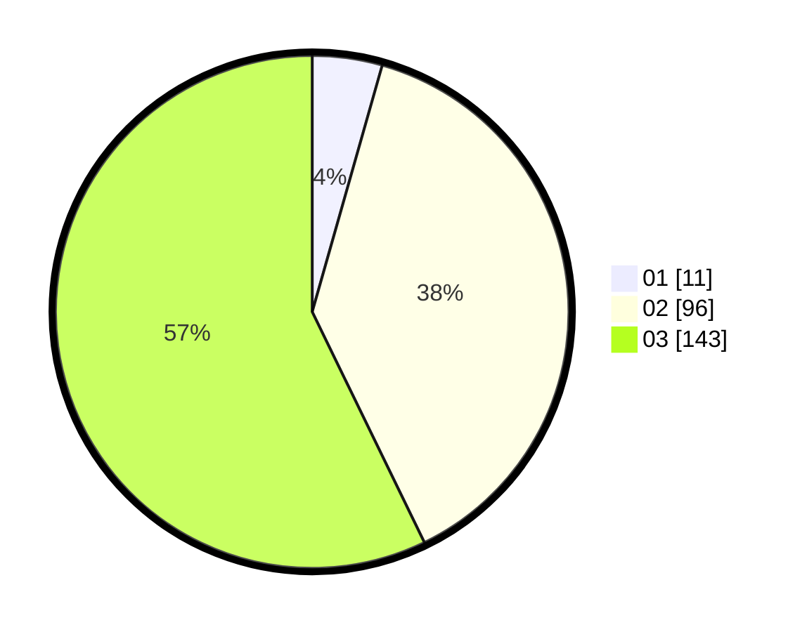

# Hasil

Hasil perolehan suara paslon dapat dilihat pada file paslon-01.txt, paslon-02.txt, dan paslon-03.txt.

Jika tidak ada, artinya data tersebut belum ada pada SIREKAP.

## Perolehan Suara

 * Paslon 01: **11**.
 * Paslon 02: **96**.
 * Paslon 03: **143**.

## Foto C Plano

https://sirekap-obj-formc.kpu.go.id/18fc/pemilu/ppwp/31/73/06/10/01/3173061001249-20240214-195514--07553b06-3d2a-4506-ba61-3c5c4edcba3f.jpg

https://sirekap-obj-formc.kpu.go.id/18fc/pemilu/ppwp/31/73/06/10/01/3173061001249-20240214-195536--fe463073-7660-49cb-91cb-805fad5b0bd6.jpg

https://sirekap-obj-formc.kpu.go.id/18fc/pemilu/ppwp/31/73/06/10/01/3173061001249-20240214-195525--57dcd6b6-9170-4061-9535-110ad6eedba1.jpg

## DATA PEMILIH TETAP

Jumlah pemilih dalam DPT: **274**.
 * L: **136**.
 * P: **138**.

## DATA PENGGUNA HAK PILIH

Jumlah pengguna hak pilih dalam DPT: **226**.
 * L: **108**.
 * P: **118**.

Jumlah pengguna hak pilih dalam DPTb: **18**.
 * L: **6**.
 * P: **12**.

Jumlah pengguna hak pilih dalam DPK: **6**.
 * L: **2**.
 * P: **4**.

Jumlah pengguna hak pilih: **250**.
 * L: **116**.
 * P: **134**.

## JUMLAH SUARA SAH DAN TIDAK SAH

JUMLAH SELURUH SUARA SAH: **250**.

JUMLAH SUARA TIDAK SAH: **0**.

JUMLAH SELURUH SUARA SAH DAN SUARA TIDAK SAH: **250**.
