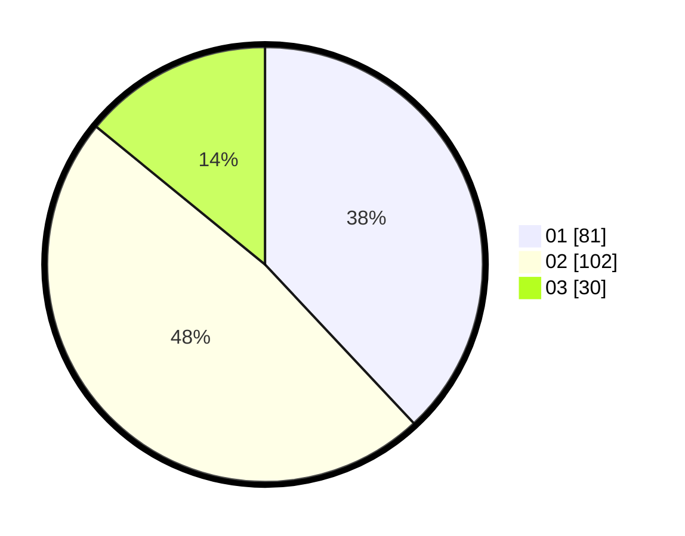

# Hasil

Hasil perolehan suara paslon dapat dilihat pada file paslon-01.txt, paslon-02.txt, dan paslon-03.txt.

Jika tidak ada, artinya data tersebut belum ada pada SIREKAP.

## Perolehan Suara

 * Paslon 01: **81**.
 * Paslon 02: **102**.
 * Paslon 03: **30**.

## Foto C Plano

https://sirekap-obj-formc.kpu.go.id/f38e/pemilu/ppwp/31/73/06/10/02/3173061002003-20240215-000538--5f9a518a-138c-4a70-9e71-ec6e6a6fbb2c.jpg

https://sirekap-obj-formc.kpu.go.id/f38e/pemilu/ppwp/31/73/06/10/02/3173061002003-20240215-000639--69dca203-b0b3-4345-b59b-c7762ace569d.jpg
