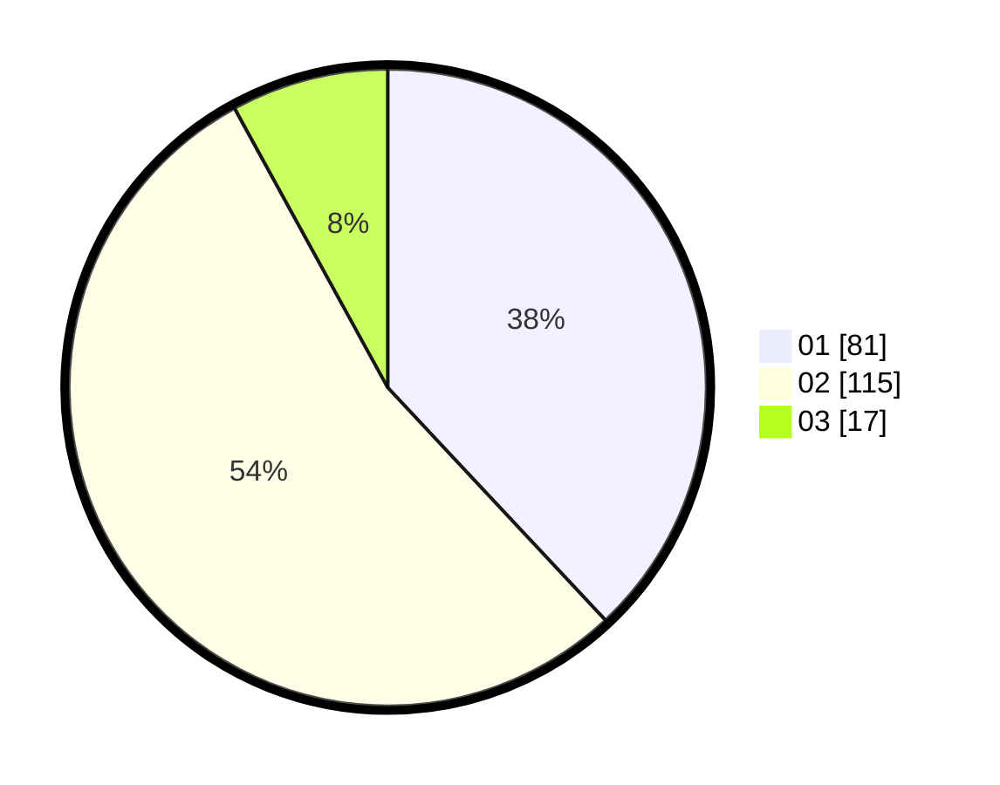

# Hasil

Hasil perolehan suara paslon dapat dilihat pada file paslon-01.txt, paslon-02.txt, dan paslon-03.txt.

Jika tidak ada, artinya data tersebut belum ada pada SIREKAP.

## Perolehan Suara

 * Paslon 01: **81**.
 * Paslon 02: **115**.
 * Paslon 03: **17**.

## Foto C Plano

https://sirekap-obj-formc.kpu.go.id/95f7/pemilu/ppwp/31/73/06/10/02/3173061002009-20240215-023148--26d95822-d929-440a-b7cc-1dd5752bfa27.jpg

https://sirekap-obj-formc.kpu.go.id/95f7/pemilu/ppwp/31/73/06/10/02/3173061002009-20240215-023236--7215bf8d-94a1-4c05-9199-736aa14b2e53.jpg

https://sirekap-obj-formc.kpu.go.id/95f7/pemilu/ppwp/31/73/06/10/02/3173061002009-20240215-023325--935c1f9e-b3a5-4cee-b562-b32a99ce274c.jpg

## DATA PEMILIH TETAP

Jumlah pemilih dalam DPT: **285**.
 * L: **154**.
 * P: **131**.

## DATA PENGGUNA HAK PILIH

Jumlah pengguna hak pilih dalam DPT: **215**.
 * L: **113**.
 * P: **102**.

Jumlah pengguna hak pilih dalam DPTb: **0**.
 * L: **0**.
 * P: **0**.

Jumlah pengguna hak pilih dalam DPK: **0**.
 * L: **0**.
 * P: **0**.

Jumlah pengguna hak pilih: **215**.
 * L: **113**.
 * P: **102**.

## JUMLAH SUARA SAH DAN TIDAK SAH

JUMLAH SELURUH SUARA SAH: **213**.

JUMLAH SUARA TIDAK SAH: **2**.

JUMLAH SELURUH SUARA SAH DAN SUARA TIDAK SAH: **215**.
